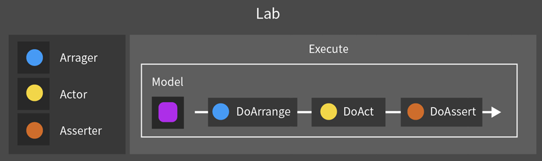
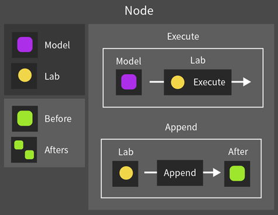
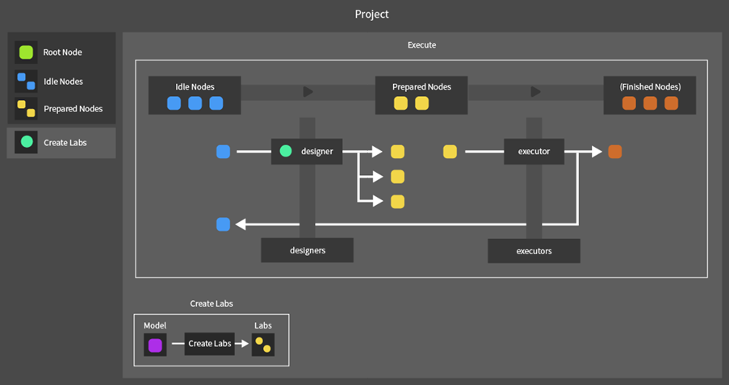
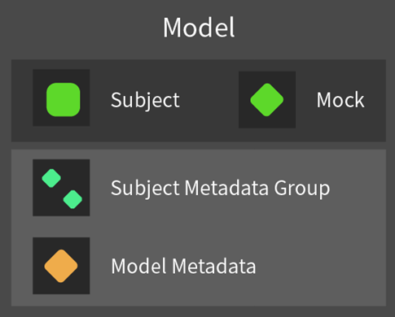
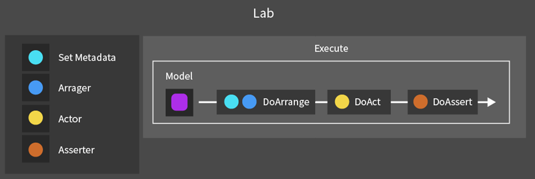
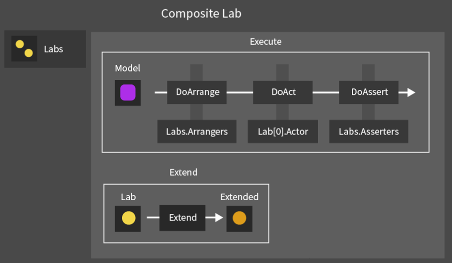

# Overview

A framework for automatically generating and executing continuous unit tests

---

## Table of Contents

1. Uni Test Overview
2. Tests for Tests with a Single State
3. Tests for Tests with Multiple Independent States

---

## 1. Uni Test Overview

Uni Test is a tool designed to test objects with various state transitions and functions through an automated method.

Through state-table-based test design, this tool automatically generates and executes every possible test case, helping secure high reliability even in complex tests.

Tests are organized based on the AAA (Arrange-Act-Assert) pattern and are performed around object state transitions and continuous operations.

| Category | Content |
| --- | --- |
| Overview | Automatic execution of tests with various states and interfaces |
| Purpose | System reliability or verification |
| Implementation | Automatic test design and execution based on state tables |

Uni Test has the following characteristics.

AAA-pattern-based test composition
- Arrange: set up the objects and states required for the test
- Act: execute the test operation
- Assert: verify the result

State-based test support
- Define the object's various states and operations through a state table
- Design and execute continuous tests that include state transitions

Test design automation
- Automatically generate every possible test case
- Automatically transition to the next test after a test ends

---

## 2. Tests for Tests with a Single State
### 2-1. Components

#### 2-1.1. Model

Model is a unit object that holds the test target object together with metadata that includes its expected state and execution data.

Model is composed of the following elements.

Components
- Subject: the actual target object on which tests are performed
- Mock: an object that describes the state being tested
- Metadata: execution information required for the test, such as execution count and delay time

#### 2-1.2. Lab

Lab contains the three functions used in a test (Arrange, Act, Assert), receives a Model from outside, and executes the test sequentially.

Lab is composed of the following elements.

Components
- Arranger: configures the Model before test execution and sets Mock to the expected state of Subject
- Actor: executes the actual test operation
- Asserter: verifies whether Subject works as expected
Functions
- Execute: executes the test for the input Model in Arrange -> Act -> Assert order

#### 2-1.3. Node

Node represents one test execution step and is composed of a pair of Model and Lab. It also helps track the test flow by referencing previous and subsequent Nodes in a continuous test flow.

Node is composed of the following elements.

Components
- Model: the Model to be used in the current step
- Lab: the Lab to be executed in the current step
- Before: the Node corresponding to the previous step
- Afters: the set of Nodes corresponding to subsequent steps

Functions
- Execute: runs Lab.Execute based on the current Node's Model
- Append: receives a new Lab and creates a subsequent Node

When Append is called, Node creates a new Model and then sequentially re-executes every Lab that has been executed so far to create a copy of the current Model. The generated Model is passed to the subsequent Node so that states from each experiment step do not interfere with each other.

### 2-2. Test Execution

#### 2-2.1. Overview

UniTest executes tests by using Node as the unit. At this time, tests proceed in the following cycle.
1. Design: create Labs that can be executed from the current Node.Model. Create new subsequent Nodes based on them
2. Execute: run Node.Execute on each Node created in the Design step to execute the tests
3. Automatic test termination: based on Node.Model.Metadata, Nodes that can continue testing move to the Design step, while other Nodes are handled as Finished Nodes

#### 2-2.2. Project

In UniTest, the object that executes tests through Nodes is called Project.
Project is composed of the following elements.

Components
- Root Node: the starting point of the test and the first Idle Node
- Idle Nodes: the set of Nodes waiting for the first step of the test cycle (Design)
- Prepared Nodes: the set of Nodes waiting for the second step of the test cycle (Execute)

Functions
- Execute: receives input and executes the full test process
- Create Labs (virtual method): creates executable Labs for the given Node.Model during the Design process

---
## 3. Tests for Tests with Multiple Independent States
### 3-1. Overview

#### 3-1.1. Test Combination

In tests with multiple independent states, the total number of possible cases is determined by multiplying the number of cases in each state. Because of this, as the independent states of the test increase, a state explosion problem can occur where the number of tests to generate increases exponentially.

UniTest adopts a method in which unit tests for each independent state are defined and then combined to automatically generate test cases for every possible state.

#### 3-1.2. Test Extension

When tests are combined, they operate by hierarchically extending another test based on an existing test. For example, if there is an existing test A and an extended test B, the test proceeds in the following order.

1. Execute A's Arrange, then execute B's Arrange
2. Execute A's Act
3. Execute B's Assert, then execute A's Assert

The reasons for adopting this execution order are as follows.

1. Guarantee object initialization order: the base state (A) must be initialized first, then the extension state (B) must be initialized for correct initialization.
2. Preserve the singularity of work: in one test flow, the principle is to perform only one work item, so A's Act, which corresponds to the base state, is executed.
3. Secure verification validity: because an error in the extension part can affect the base part, the extension part must be verified before the validity of the base part is checked.

#### 3-1.3. Test Types

When there is an existing test A and a test B that extends it, test B must be designed on the premise that A's Act will be executed. However, because B's Model cannot directly design which Act to execute, it must explicitly tell A which test operation should be executed.

For this flow, UniTest predefines the test types available to the object, and the test generator receives this type as an argument so that it can flexibly compose the corresponding test.

Test types may all exist on the same level, but there may also be a type that includes several lower types. In this case, the test generator can choose one of the following two methods.

- Common test generation: generate the same test based only on the lower type, regardless of other types
- Branch test generation: generate different tests according to other types

#### 3-1.4. Test Generator

In UniTest, each independent state has a generator that creates tests for that state. Each generator operates independently, and lower generators can inherit upper generators to compose tests as a whole.

Tests are generated by starting from the lower generator and assembling upward into the upper generator. The lower generator creates tests for the input test type, then passes the same type to the next upper generator and requests additional test generation. After that, it combines the tests it created with the tests returned from the upper generator and returns one extended test set.

Depending on the test type, there may be cases where a generator must create tests by itself without calling the upper generator. In this situation, that generator effectively acts as the top-level generator and is responsible for creating the Act. Through this structure, if test methods generated by test type are defined in advance, generators at every level can compose tests in the same way, preserving design consistency.

### 3-2. Components

#### 3-2.1. Model

In tests for tests with multiple independent states, Model is composed of the following elements.

Components
- Subject: the actual target object on which tests are performed
- Mock: an object that describes the state being tested
- Subject Metadata Group: the metadata group used for tests corresponding to each independent state
- Metadata: execution information required for the test, such as execution count and delay time

#### 3-2.2 Lab

Lab is an object that executes a test for one independent state.
Lab is composed of the following elements.

Components
- Set Metadata: configures test metadata for the corresponding state
- Arranger: configures the Model before test execution and sets Mock to the expected state of Subject
- Actor: executes the actual test operation
- Asserter: a function that verifies whether Subject works as expected
- Execute: executes the test for the input Model in Arrange -> Act -> Assert order

#### 3-2.2-1. Composite Lab

Composite Lab is an object that groups Labs for each independent state and executes them sequentially.
Composite Lab is composed of the following elements.

Components
- Labs: the set of Labs corresponding to each independent state

Functions
- Execute: executes the test for every included Lab in Arrange -> Act -> Assert order
- Extend: adds a new lower Lab and creates an extended Composite Lab

Composite Lab implements ILab, a common interface, together with Lab, and can be used as a direct replacement anywhere an existing Lab was used. This allows Composite Lab to be applied to existing tests without modifying the existing Project structure or execution flow.
