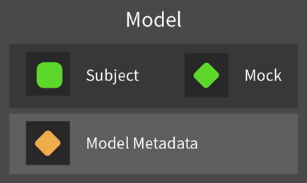

# Overview

A framework for automatically generating and executing continuous unit tests.

---

## Table of Contents

1. UniTest Overview
2. Testing Tests With One State Type
3. Testing Tests With Multiple Independent State Types

---

## 1. Introducing UniTest

UniTest is a tool designed to test tests that have various state transitions and functions in an automated way.

Through state-table-based test design, this tool automatically generates and executes every possible test case, helping secure high reliability even in complex tests.

Tests are organized around the AAA (Arrange-Act-Assert) pattern and are performed around object state transitions and continuous operations.

| Category | Content |
| --- | --- |
| Overview | Automatic execution of tests with various states and interfaces |
| Purpose | System reliability or verification |
| Implementation | Automatic test design and execution based on state tables |

UniTest has the following characteristics.

AAA-pattern-based test organization
- Arrange: set the objects and state needed for the test
- Act: execute the test operation
- Assert: verify the result

State-based test support
- Define various states and operations of the object through state tables
- Design and execute continuous tests including state transitions

Test design automation
- Automatically generate every possible test case
- Automatically transition to the next test after a test finishes

---

## 2. Testing Tests With One State Type
### 2-1. Components

#### 2-1.1. Model

Model is a unit object that holds the object under test, its expected state, and meta information including execution data.

Model consists of the following elements.

Components
- Subject: the target object on which the actual test is performed
- Mock: an object that describes the state being tested
- Metadata: execution information needed for the test, such as execution count and delay time

#### 2-1.2. Lab

Lab contains the three functions used in a test (Arrange, Act, Assert), receives a Model from outside, and executes the test sequentially.

Lab consists of the following elements.

Components
- Arranger: sets up the Model before test execution and sets the Mock to the Subject's expected state
- Actor: executes the actual test operation
- Asserter: verifies that the Subject works as expected
Functions
- Execute: executes the test for the input Model in the order Arrange -> Act -> Assert

#### 2-1.3. Node

Node represents one test execution step and consists of a pair of Model and Lab. It also references previous and following Nodes in a continuous test flow, helping track the test flow.

Node consists of the following elements.

Components
- Model: the Model used in the current step
- Lab: the Lab executed in the current step
- Before: the Node corresponding to the previous step
- Afters: the set of Nodes corresponding to following steps

Functions
- Execute: runs Lab.Execute based on the current Node's Model
- Append: creates a following Node from a new input Lab

When Append is called, Node creates a new Model and then re-executes every Lab that has been executed so far in sequence to create a copy of the current Model. The generated Model is passed to the following Node so that states between experiment steps do not interfere with each other.

### 2-2. Test Execution

#### 2-2.1. Overview

UniTest executes tests using Node as the unit. At this time, testing proceeds in the following cycle.
1. Design: generate Labs executable from the current Node.Model. Based on these, create new following Nodes.
2. Execute: perform Node.Execute for each Node created in the Design stage and execute the tests.
3. Automatic test completion: based on Node.Model.Metadata, Nodes that can continue testing move to the Design stage, and Nodes that cannot are handled as Finished Nodes.

#### 2-2.2. Project

In UniTest, the object that executes tests through Nodes is called a Project.
Project consists of the following elements.

Components
- Root Node: the starting Node of the test and the initial Idle Node
- Idle Nodes: the set of Nodes waiting for the first stage of the test cycle (Design)
- Prepared Nodes: the set of Nodes waiting for the second stage of the test cycle (Execute)

Functions
- Execute: executes the full input test process
- Create Labs (virtual method): creates executable Labs for the given Node.Model during the Design process

---
## 3. Testing Tests With Multiple Independent State Types
### 3-1. Overview

#### 3-1.1. Test Combinations

For tests with multiple independent states, the total number of possible cases is determined by multiplying the number of cases each state has. Because of this, as independent states in a test increase, the test can face a state explosion problem where the number of tests that must be generated grows geometrically.

UniTest adopts a method where unit tests for each independent state are defined and then combined to automatically generate test cases for every possible state.

#### 3-1.2. Test Extension

When combining tests, the system works by hierarchically extending other tests based on existing tests. For example, if there is an existing test A and an extended test B, testing proceeds in the following order.

1. Execute A's Arrange, then execute B's Arrange
2. Execute A's Act
3. Execute B's Assert, then execute A's Assert

The reasons for adopting this execution order are as follows.

1. Guarantee object initialization order: the base state (A) must be initialized first, then the extended state (B) must be initialized for correct initialization.
2. Preserve operation singularity: in one test flow, only one operation should be performed, so A's Act, which corresponds to the base state, is executed.
3. Secure verification validity: if an error occurs in the extension part, it may affect the base part as well, so the extension part must be verified before checking the validity of the base part.

#### 3-1.3. Test Types

When an existing test A and an extended test B exist, test B must be designed on the assumption that A's Act will be executed. However, because B's Model cannot directly design the Act to be executed, it must explicitly tell A which test operation should be executed.

For this flow, UniTest predefines the test types available to the object, and the test generator receives this type as an argument so that it can flexibly configure the corresponding test.

Test types may all exist at the same hierarchy level, but there may also be a type that contains several lower-level types. In this case, the test generator can choose one of the following two methods.

- Common test generation: generate the same test based only on the lower-level type, regardless of other types
- Branch test generation: generate different tests depending on other types

#### 3-1.4. Test Generator

In UniTest, each independent state has a generator that creates tests for that state. Each generator operates independently, and a lower generator can inherit the upper generator to configure the overall test.

Tests are generated by starting from the lower generator and assembling toward the upper generator. The lower generator creates a test corresponding to the input test type, then passes the same type to the upper generator in the next stage and requests additional test generation. After that, it combines the test it created with the tests returned from the upper generator and returns one extended test set.

Depending on the test type, a generator may need to create tests on its own without calling the upper generator. In this situation, that generator effectively acts as the top-level generator and is responsible for creating the Act. Through this structure, once test methods generated for each test type are predefined, generators at every level can configure tests in the same way, preserving design consistency.

### 3-2. Components

#### 3-2.1. Model

For tests with multiple independent states, Model consists of the following elements.

Components
- Subject: the target object on which the actual test is performed
- Mock: an object that describes the state being tested
- Subject Metadata Group: metadata groups used in tests corresponding to each independent state
- Metadata: execution information needed for testing, such as execution count and delay time

#### 3-2.2 Lab

Lab is an object that executes tests for one independent state.
Lab consists of the following elements.

Components
- Set Metadata: configures test metadata for the relevant state
- Arranger: sets up the Model before test execution and sets the Mock to the Subject's expected state
- Actor: executes the actual test operation
- Asserter: function that verifies whether the Subject works as expected
- Execute: executes the test for the input Model in the order Arrange -> Act -> Assert

#### 3-2.2-1. Composite Lab

Composite Lab is an object that groups the Labs corresponding to each independent state and executes them sequentially.
Composite Lab consists of the following elements.

Components
- Labs: the set of Labs corresponding to each independent state

Functions
- Execute: executes the test for every included Lab in the order Arrange -> Act -> Assert
- Extend: creates an extended Composite Lab by adding a new lower Lab

Composite Lab implements the common interface ILab together with Lab, and can be substituted directly in every place where Lab was used in existing tests. This allows Composite Lab to be applied to existing tests without modifying the existing Project structure or execution flow.
