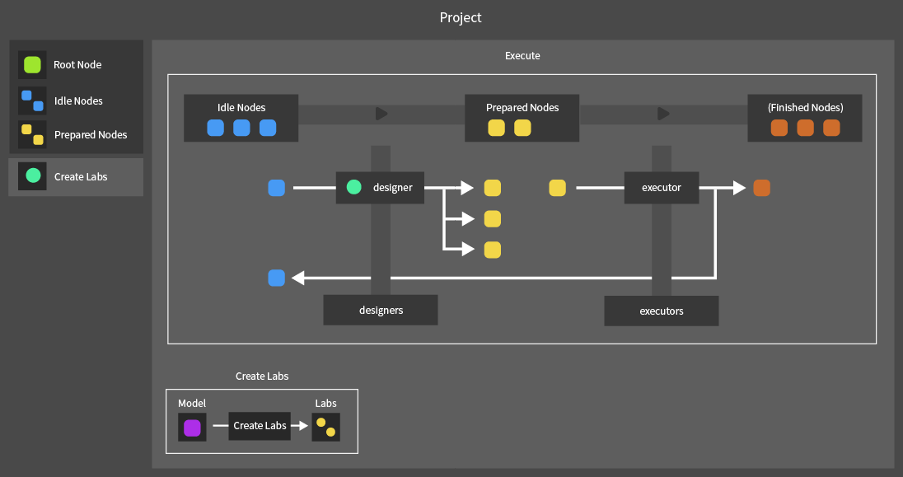

# Table of Contents

1. UniTest Structure

2. Lab Behavior
    2.1 Lab Behavior
    2.2 Compact Lab Behavior
    2.3 Composite Lab Behavior
    2.4 Extending Labs Through Merge

3. Node Behavior
    3.1 Node Behavior
    3.2 XML Report Generation

4. Project Behavior
    4.1 Project Behavior Pipeline
    4.2 Understanding TestCase

5. Test Design
    5.1 Test Design for a System With One State Type
    5.2 Test Design for a System With Multiple Independent State Types

---
## 1. UniTest Structure

UniTest has the following structure.


Components

**Model: test target unit object interface**
- `Subject`: the target object on which the actual test is performed
- `Metadata Group`: metadata storage specified by each Lab
- `Model Metadata`: test progress information for the Model (continuability, remaining test count, and so on)

**Subject Metadata: metadata specified by each Lab**
- `Metadata`: metadata specified by the Lab (object)
- `Expected Exception Type`: the exception type expected when the Lab performs Act
- `Model Metadata`: execution state information of the Model expected by the Lab

**ILab: common Lab interface**
- `ID`: Lab identifier
- `Execute(IModel model)`: performs the test on model

**Lab: single AAA test unit**
- `SetMetadata(IModel) => object`: returns Metadata to store in the Model immediately before Arrange
- `Arranger(IModel, SubjectMetadata)`: sets up the initial test state
- `Act(IModel, SubjectMetadata)`: performs the test operation
- `Assert(IModel, SubjectMetadata)`: verifies the test result

**Composite Lab: integrated test for multiple states**
- `CompositeLab(Lab original, Lab extension)`: extends the original Lab with an extension Lab
- `Extend(Lab extension)`: adds a new Lab to the current composition structure

**Compact Lab: Lab builder** (a concise Lab builder that composes each AAA function using only IModel when SubjectMetadata is not used in a single-state test)

**Node: test execution unit** (a pair of Model and Lab corresponding to one test)
- `ID`: Node identifier (same as Lab ID)
- `Model`, `Lab`: the Model and Lab objects corresponding to the test
- `Before`, `Afters`: linked Nodes corresponding to previous and following tests
- `Execute()`: executes the stored Lab against its own Model

**Project: controller for full test execution**
- `Execute(int depth)`: executes every possible test up to the specified depth
- `Terminate()`: stops test execution
- `CreateLabs(IModel) => IEnumerable<ILab>` : creates possible Labs for the input model (template method)

**Test Designer: next-test generator**
- `Execute()`: creates the next-stage Nodes possible for the current Model

**Test Executor: test executor**
- `Execute()`: progresses the test by executing the current Node.Execute

**TestCase: test execution information**
- `TestCases`: step-by-step execution information for the test

---

## 2. Lab Behavior

### 2-1 Lab Behavior

Lab is an execution-unit object that performs the actual test against a Model.

Lab is an immutable object thoroughly separated from Model, and it does not hold any test target data internally. This structure secures Lab reusability and parallel-processing safety, and allows the same Lab to be reused repeatedly in various test environments.

Lab has methods that perform the following work.

#### 2-1.1. Creation and Initialization

Lab completes preparation with the following arguments.

1.  `ID`: Lab identifier

2.  Arguments for performing the AAA process
    - `SetMetadata(IModel) => object` : creates metadata to store in the Model immediately before the test
    - `Arranger(IModel, SubjectMetadata)`: sets the Model to its initial state
    - `Act(IModel, SubjectMetadata)`: performs the test operation
    - `Assert(IModel, SubjectMetadata)`: verifies the test result

3.  Subject Metadata
    - `ExpectedExceptionType`: the expected exception type when Act is performed
    - `ToUncontinuable`: when true, the test ends with this test as the final one
    - `RemainingExecutionCount`: remaining test execution count

#### 2-1.2. Do Arrange

The Arrange stage configures the initial state of the Model.

1.  Copy the Lab's Subject Metadata and create new Subject Metadata (from this point on, the metadata is considered owned by the Model)
2.  Call SetMetadata to create test state information and store it in the copied metadata
3.  Store the completed SubjectMetadata in Model.MetadataGroup
4.  Execute the Arranger delegate and perform the actual Arrange process on the input Model

#### 2-1.3. Do Act

Execute the Actor delegate and perform the actual Act process. Based on the expected return exception type, it returns a failure exception both when an exception should have occurred but did not, and when an exception should not have occurred but did.

#### 2-1.4. Do Assert

Execute the Asserter delegate and perform the actual Assert process. If the test result differs from the expectation, the Asserter returns a failure exception.

When Lab is executed independently, the Lab's Execute method calls DoArrange, DoAct, and DoAssert in order to run the test. If Lab is included as part of a CompositeLab, the CompositeLab calls the relevant Lab methods sequentially.

Lab.Execute performs the full test in the following order.

0. Add experiment history to the Model and initialize Model.MetadataGroup
1. Run Do Arrange; if an error is returned, stop the test and prevent following tests on the Model
2. Run Do Act; if an error is returned, stop the test and prevent following tests on the Model
3. Run Do Assert; if an error is returned, stop the test and prevent following tests on the Model
4. Reflect test continuability and remaining test count stored in Model.Metadata back into the Model, then finish the test

### 2-2. Compact Lab Behavior

Compact Lab is a builder object that allows Lab to be composed without Subject Metadata. It is designed so that tests can be defined and executed simply using only Model in environments that do not use metadata, such as single-state tests.

Compact Lab uses the following arguments and creates a normal Lab when the Build() method is called.

| Compact Lab | Build | Lab |
| --- | --- | --- |
| ID | -> | ID |
| None | -> | SetMetadata (_ => null) |
| Arranger (IModel) | -> | Arranger (IModel, SubjectMetadata = null) |
| Actor (IModel) | -> | Actor (IModel, SubjectMetadata = null) |
| Asserter (IModel) | -> | Asserter (IModel, SubjectMetadata = null) |
| None (replaced with Assert.Throws) | -> | expectedExceptionType (null) |
| ToUncontinuable | -> | ToUncontinuable |
| RemainingExecutionCount | -> | RemainingExecutionCount |

Characteristics

- Implements the AAA structure based only on IModel
- Internally, SubjectMetadata is always passed and handled as null
- Exception handling is implemented by defining Assert.Throws in Assert instead of using ExpectedExceptionType

### 2-3. Composite Lab Behavior

Composite Lab is an object that connects several Labs sequentially to form one test flow. Each Lab tests an independent state unit, and Composite Lab performs the full system test by calling them in an appropriate order.

Composite Lab has the following two methods.

- `Extend(Lab extension)`: adds the input Lab to the lowest level of the existing test chain and extends the test
- `Execute`: executes the registered Labs in the correct order and performs the full test

Composite Lab's Execute works in the following order.

#### 2-3.0. Preprocessing

- Add test execution history to the Model and initialize MetadataGroup.

#### 2-3.1. Do Arrange (upper -> lower order)

- Execute each Lab's DoArrange from upper Lab to lower Lab. Correct initialization can be performed only when the original state is initialized first and then the extended state is set.
- If an exception occurs, stop the test and prevent following tests on that Model.

#### 2-3.2. Do Act (execute only the topmost Lab)

- Perform only the topmost Lab's DoAct. This is because one test flow should perform only one Act, and duplicate execution can cause unintended side effects.
- If an exception occurs, stop the test and prevent following tests on that Model.

#### 2-3.3. Validity Decision

- Check SubjectMetadata.ToUncontinuable for every Lab, and immediately stop the test if any value is true. If even one uncontinuable state has occurred, the Model itself may have transitioned to an unreliable state.

#### 2-3.4. Do Assert (lower -> upper order)

- Execute each Lab's DoAssert in reverse order, from lower Lab to upper Lab. The validity of the extended state must be verified first, then the original state stacked above it, so that responsibility can be traced accurately when a problem occurs.

- If an exception occurs, stop the test and prevent following tests on that Model.

#### 2-3.5. Reflect Test State

- Update the Model's test continuability, remaining test count, and similar values according to the ModelMetadata held by the topmost Lab, then finish the test.

### 2.4 Extending Labs Through Merge

Labs can be extended or derived in various ways depending on the test type. For example, when testing an Act that increases a value, there can be several detailed cases like the following.

- The value increases by 1
- The value increases by 10
- The value increases by the default argument
- The value increases by 0
- The value increases by a negative number, and so on

Because implementing all these various situations as individual Labs is inefficient, first define the AAA logic for the basic situation, then modify each element depending on the situation and extend the Lab. This method can generate tests for various situations efficiently.

An example of extending a Lab through Merge is as follows.

1. Define the base Lab

```csharp
var template = new Lab<Model>("Increase")
{
    Arranger = (model, metadata) =>
        model.value = (int)metadata.Metadata.value,

    Actor = (model, metadata) =>
        model.Increase((int)metadata.Metadata.value),

    Asserter = (model, metadata) =>
        Assert.AreEqual(model.value, model.Subject.value)
};
```

2. Define individual Labs based on the base Lab

```csharp
yield return new Lab<Model>("1")
{
    SetMetadata = _ => 1,
}.Merge(template);

yield return new Lab<Model>("10")
{
    SetMetadata = _ => 10,
}.Merge(template);

yield return new Lab<Model>("default")
{
    Arranger = (model, _) => model.value = model.defaultValue,
    Actor = (model, _) => model.Increase()
}.Merge(template, useArranger: false, useActor: false);

yield return new Lab<Model>("0")
{
    SetMetadata = _ => 0,
}.Merge(template);

yield return new Lab<Model>("negative")
{
    SetMetadata = _ => -1,
    Arranger = (_, metadata) =>
    {
        metadata.ToUncontinuable = true;
        metadata.ExpectedExceptionType = typeof(ArgumentOutOfRangeException);
    },
}.Merge(template, useArranger: false, useAsserter: false);
```

This has the same effect as creating each of the following Labs.

```csharp
yield return new Lab<Model>("1")
{
    SetMetadata = _ => 1,

    Arranger = (model, metadata) =>
        model.value = (int)metadata.Metadata.value,
    Actor = (model, metadata) =>
        model.Increase((int)metadata.Metadata.value),
    Asserter = (model, metadata) =>
        Assert.AreEqual(model.value, model.Subject.value);
};

yield return new Lab<Model>("10")
{
    SetMetadata = _ => 10,

    Arranger = (model, metadata) =>
        model.value = (int)metadata.Metadata.value,
    Actor = (model, metadata) =>
        model.Increase((int)metadata.Metadata.value),
    Asserter = (model, metadata) =>
        Assert.AreEqual(model.value, model.Subject.value);
};

yield return new Lab<Model>("default")
{
    Arranger = (model, _) =>
        model.value = model.defaultValue,
    Actor = (model, _) =>
        model.Increase(),
    Asserter = (model, metadata) =>
        Assert.AreEqual(model.value, model.Subject.value)
};

yield return new Lab<Model>("0")
{
    SetMetadata = _ => 0,

    Arranger = (model, metadata) =>
        model.value = (int)metadata.Metadata.value,
    Actor = (model, metadata) =>
        model.Increase((int)metadata.Metadata.value),
    Asserter = (model, metadata) =>
        Assert.AreEqual(model.value, model.Subject.value);
};

yield return new Lab<Model>("negative")
{
    SetMetadata = _ => -1,
    Arranger = (_, metadata) =>
    {
        metadata.ToUncontinuable = true;
        metadata.ExpectedExceptionType = typeof(ArgumentOutOfRangeException);
    },
    Actor = (model, metadata) => model.Increase((int)metadata.Metadata.value)
};
```

Combining Labs using Composite Lab and combining Labs using Merge have the following differences.

| Category | Composite Lab | Merge |
|---|---|---|
| Purpose | Compose one integrated test by combining multiple state-unit tests for one Act | Generate several derived tests from a base test within one state unit |
| Execution order | Execute lower -> upper Labs sequentially; DoArrange (upper -> lower); DoAct (topmost once); DoAssert (lower -> upper) | Execute template Lab -> derived Lab; template Arrange -> derived Arrange; template Act -> derived Act; template Assert -> derived Assert |
| Selective execution of upper Lab | Not possible: every Lab executes in fixed order | Possible: unnecessary stages can be skipped when creating derived Labs |
| State-unit report | Supported: the report displays which stage the failed Lab belongs to | Not supported: the report does not display whether the failure occurred in the template stage or the derived stage |

---

## 3. Node Behavior

### 3-1. Node Behavior

Node is an object that represents one test execution step and is composed of a pair of Model and Lab.
Node represents a single step in the test flow, and its Before and Afters fields, which represent the before/after relationship of tests, can configure the transition flow of tests.

Node has methods that perform the following work.

#### 3-1.1. Creation and Initialization

Node can be created in the following two ways.

1.  Node(Lab lab)
    - Used when creating the first execution step of a test.
    - Creates a new Model and sets the passed lab as the target Lab to execute.

2. Node(Node before, Lab lab)
    - Used when creating the second or later step of a test.
    - Creates a new Model and sets the passed lab as the target Lab to execute.
    - Stores the before Node in the current Node's Before field and adds itself to the before.Lab.Afters list to form a connection between Nodes.
    - Then recursively searches its previous Nodes, stores the Labs of those Nodes in order, and executes those Labs sequentially on the current Node's Model, so that the Model state matches the initial state required by the input Lab.

#### 3-1.2. Test Execution

Node performs a test by executing the stored Lab against the relevant Model through the Execute method. If a test failure or exception occurs during test execution, Node stores that exception in its Exception field and sets Model.Continuable to false, blocking further tests. Also, even if no exception occurs during the test process, calling SetExternalException from outside can manually inject a forced-stop exception caused by external factors such as user interruption or test environment error.

### 3-2. XML Report Generation

Node stores information about the test execution flow, such as its own state, test result, and following Node connections, in XML format. This report allows the user to trace the test expansion process and confirm which test failed in which context.

Node has the following XML information.

- Inner Text: test progress information
- Root Node: the starting point of the test, and has no Model or Lab
- Waiting For Execution: the test has not been executed yet
- Success/Failed: whether the progressed test succeeded or failed
- Report: failure exception information
- Model: test target model object information held by the current Node
- History: the list of Lab IDs that have been performed on the Model so far
- Continuable: whether the state can perform following tests
- Error: exception information when an error occurs while generating the XML report
- Child Node: XML file of the Node progressed afterward

The user can selectively retrieve experiment information using the following extension methods.

- Count(Node) => int : the number of Nodes created after the relevant Node
- All Succeed(Node) => bool : whether every test after the relevant Node succeeded
- Get Failed Nodes(Node) => XmlNode : returns the XML information for every failed test Node after the relevant Node

---

## 4.Project Behavior

### 4-1. Project Behavior Pipeline

Project is the core object that performs tests by calling each Node's Execute method, then creates following Nodes according to the state of Node.Model and builds a continuous test flow.

Project consists of the following structure.



Components

- `Root Node`: the Node that becomes the starting point of the test and corresponds to the initial Idle Node
- `Idle Nodes`: the set of Nodes waiting for the first stage of the test cycle (Design)
- `Prepared Nodes`: the set of Nodes waiting for the second stage of the test cycle (Execute)

Methods

- `Execute`: executes the full test process
- `Create Labs` (template method): creates executable Labs for the given Node.Model during the Design process

Project works as follows.

#### 4-1.0. Root Node Creation

Root Node is the Node that becomes the starting point of every test Node and does not have a Model or Lab. Root Node is stored in Idle Nodes before Project.Execute is run.

#### 4-1.1. Following Node Creation

As the first process of Project.Execute, following Nodes are created for every Node currently in Idle Nodes. At this time, an object called Test Designer is responsible for creating following Nodes for a single Node.

Test Designer uses Project.CreateLabs to create following tests for the input Node and creates following Nodes based on them. The generated following Nodes have the Lab and a copy (reproduction) of the Model that existed in the original Node. The generated following Nodes are then stored in Project.Prepared Nodes.

Because Model copying is performed by creating a new Model and then restoring state by re-executing previous Labs in order, it can consume many resources depending on the test. Therefore, Test Designer's work is performed asynchronously.

#### 4-1.2. Node Test Execution

As the second process of Project.Execute, Execute is called for every Node currently in Prepared Nodes and the actual tests are performed. At this time, an object called Test Executor is responsible for executing a test for a single Node, and it executes Node.Execute in an asynchronous environment so that the overall test flow does not stop.

When a Node finishes testing, it is stored in Project.Idle Nodes if it is in a state where testing can continue; otherwise it is not stored in Project. Even if a Node is not stored in Project, the user can access completed Nodes through the Node chain connected from Root Node in tree form.

#### 4-1.3. Test Completion

Project.Execute can stop through the following conditions.

1.  Every Node satisfies the preset test depth
2.  The test time limit is exceeded
3.  An exception occurs during testing
4.  The user directly stops the test, and so on

When testing stops, Project returns Root Node, allowing the user to check the full progress of the test.

### 4.2 Understanding Test Case

#### 4-2.1. Test Case Extension

As seen earlier in '2.4 Extending Labs Through Merge', tests can be extended and derived in various ways depending on their type. For example, when testing an Act that increases a value, there can be the following detailed cases.

- Increase the value by 1
- Increase the value by 10
- Increase the value by the default argument
- Increase the value by 0 or by a negative number, and so on

For an object with multiple independent states, if the part responsible for a lower state writes tests while considering every detailed test situation of the upper stage, the structure can become very complex. To solve this, UniTest uses the following strategy.

- Define only universal commands in the lower state.
- In the stage that composes the actual test, extend and compose tests corresponding to each detailed case.

Test Case is an object that sequentially stores these test commands by concretization stage. For example, the command 'increase the value by 1' is stored in the following two stages.

- Stage 1: 'increase value' (command type)
- Stage 2: 'increase by 1' (concrete execution condition)

If the upper object wrote only the first stage, 'increase value', the composition part expands and composes the test into every case corresponding to that stage. If both the first and second items are written in the Test Case, the composition stage writes only the corresponding single test.

#### 4-2.2. Exclusive Test Case Definition

When tests are composed using a State Table, tests that can be applied to Model are written based on every independent state combination that the Model can have, so a lower state may receive a test command that is unrelated to itself. For example, in a kickboard object with 'mounted state' as the upper state and 'charging state' as the lower state, the action 'dismount kickboard' may have no meaning for the 'charging state' or may not be an object of interest.

In this way, if the input Test Case is unrelated to a lower state, the lower state can pass the test corresponding to its own stage by not setting its Arranger / Asserter.

Test Case implements the following methods to determine whether the input definition corresponds to itself and, when necessary, provide a more precisely concretized Test Case.

- `Confineable(int index, out confined, object[] definitions) => bool`
    Returns true when the item at the given stage (index) is included in definitions, and returns a concretized TestCase satisfying that condition through confined.

- `ConfineableExcept(int index, out confined, object[] definitions) => bool`
    Returns true when the item at the given stage (index) is not included in definitions, and simultaneously returns a concretized TestCase excluding that condition through confined.

Test Case also implements the following methods that can concretize itself.

- `Append(object definition, bool include)`: concretizes the next stage to include or exclude definition
- `Confine(int index, object definition)`: fixes the item at a specific stage to the given definition
- `Include(int index, object[] definitions)`: concretizes the item at a specific stage so that it includes every item in the input list
- `Exclude(int index, object[] definitions)`: concretizes the item at a specific stage so that it does not include every item in the input list

---
## 5. Test Design

### 5-1. Test Design for a System With One State Type

Tests for a single-state-based system are designed in the following stages.

#### 5-1.1. Define the State - Operation Table

First, write a single state-operation table for the object and organize every state and operation the object can have. Designing tests based on this table allows tests corresponding to every use case of the object to be designed systematically.

For example, the state-operation table for an electric kickboard is as follows.

States

- Idle: rider waiting state
- Mounted: rider is using the kickboard
- Disposed: disposed state

Operations

- Mount: start rider use
    - Licensed: start use by a licensed rider
    - Same: a rider who is already using the kickboard tries to use it again
    - Not Licensed: an unlicensed rider tries to use it
    - Null: a null rider tries to use it
- Ride: the rider actually rides the kickboard
- Dismount: end rider use
- Dispose: dispose the kickboard

| Kickboard | - | Mount | < | < | < | Ride | Dismount | Dispose |
| --- | --- | --- | --- | --- | --- | --- | --- | --- |
| | - | Licensed | Same | Not Licensed | Null | | | |
| | - | | | | | | | |
| Idle | - | **Mounted** | X | _InvalidOperation_ | `<Dismount>` | _InvalidOperation_ | - | **Disposed** |
| Mounted | - | _InvalidOperation_ | - | _InvalidOperation_ | ^ | `[Ride]` | **Idle** | `<Dismount>` -> `<Dispose>` |
| Disposed | - | _ObjectDisposed_ | X | _ObjectDisposed_ | ^ | _ObjectDisposed_ | - | - |

#### 5-1.2. Define the Model

The model class used in tests is defined by inheriting from UniTest.Model. This model includes the actual test target, Subject, the Mock object that contains expected state, and external resources (Assets) needed for experiments.

The following is an example Model class for testing an electric kickboard object.

```csharp
public class Model : UniTest.Model
{
    // Subject
    public SingleStatedKickboard Kickboard
    {
        get => (SingleStatedKickboard)Subject;
        set => Subject = value;
    }

    // Mock
    public Rider rider;
    public bool isDisposed;

    // Assets
    public Rider TargetedRider;
    public int RideCount = 0;
    public void OnRide() => RideCount++;

    // Content
    public override string ToString()
    {
        var sb = new StringBuilder();

        sb.Append($"Rider : {Kickboard.Rider?.Name ?? "None"}, ");
        sb.Append($"Disposed : {Kickboard.IsDisposed} | ");
        sb.AppendLine(base.ToString());

        return sb.ToString();
    }
}
```

Components

- `Subject`: the actual test target object. Because `base.Subject` is object type, it is cast to the domain type suitable for the test and used.
- `Mock`: by defining the expected state externally, the object's internal state can be verified indirectly. Through this, test accuracy can be secured without accessing private members.
- `Assets`: objects to use in experiments.
    - `Target Rider`: used to test a situation where the same `Rider` mounts again.
    - `OnRide`: used to confirm that the `Kickboard.OnRide` delegate is called normally.
- `Content`: other methods needed for experiments. In the case of `ToString`, it provides a readable string to use when recording `Model` in the `Node` XML file.

#### 5-1.3. Define the Project

Write the object that performs the actual test by inheriting from the UniTest.Project object.

Here, before writing the actual tests, the two items below were written to allow smooth test progress.

- `KickboardState`/`GetState`: an enum and method that determine which state in the state-operation table the kickboard currently belongs to. It receives Model and returns the kickboard state.
- `Check`: a method that compares the kickboard's actual state with the Mock state and checks whether they match. It is mainly called in the Assert stage and verifies whether the expected state and actual state match.

```csharp
enum KickboardState
{

    Idle,
    Mounted,
    Disposed,
}

KickboardState GetState(Model model)
{
    if (model.Kickboard.IsDisposed)
        return KickboardState.Disposed;
    if (model.Kickboard.Rider != null)
        return KickboardState.Mounted;
    else
        return KickboardState.Idle;
}

private void Check(Model model)
{
    Assert.IsNotNull(model, "Kickboard is Null");
    Assert.AreEqual(model.isDisposed, model.Kickboard.IsDisposed, "Dispose state mismatched");
    Assert.AreSame(model.rider, model.Kickboard.Rider, "Rider mismatched");
}
```

After preparation is complete, implement the CreateLabs template method and define which test cases should be generated for the given Model. In this implementation example, the test flow is designed by branching according to whether Model.Subject is null.

When Model.Subject is null, that is, when the kickboard has not yet been created, a test is written that creates the kickboard, sets Mock data needed for the experiment, and verifies its validity.

```csharp
protected override IEnumerable<ILab<Model>> CreateLabs(Model model)
{
    var labs = new List<CompactLab<Model>>();

    // Ignite
    if (model.Kickboard == null)
    {
        labs.Add(new("Ignite")
        {
            Actor = m =>
            {
                m.Kickboard = new();
                m.rider = null;
                m.isDisposed = false;
                m.TargetedRider = new(true, "Targeted Rider");
            },
            Asserter = Check
        });

        return labs.Select(l => l.Build());
    }

    // Handling when Model is not null
    // ...
}
```

When the kickboard has not been created, the Actor stage initializes the kickboard and sets related state. Then Check verifies whether the generated object's state matches the expected state.

When Model.Subject already exists, tests are written as follows.

1. Design test groups for every action the kickboard can perform.
2. For each experiment group, design tests that the kickboard can execute in its current state.
3. Return every designed test.

```csharp
protected override IEnumerable<ILab<Model>> CreateLabs(Model model)
{
    var labs = new List<CompactLab<Model>>();

    // Handling when Model is null
    // ...

    // Mount
    switch (GetState(model))
    {
        case KickboardState.Idle:
            labs.Add(new("Mount_Licensed")
            {
                Arranger = m => m.rider = new Rider(true),
                Actor = m => m.Kickboard.Mount(m.rider),
                Asserter = Check
            });
            labs.Add(new("Mount_Targeted")
            {
                Arranger = m => m.rider = m.TargetedRider,
                Actor = m => m.Kickboard.Mount(m.rider),
                Asserter = Check
            });
            labs.Add(new("Mount_NotLicensed")
            {
                Actor = m => Assert.Throws<InvalidOperationException>(() => m.Kickboard.Mount(new Rider(false))),
                ToUncontinuable = true
            });
            labs.Add(new("Mount_Null")
            {
                Arranger = m => m.rider = null,
                Actor = modml => modml.Kickboard.Mount(null),
                Asserter = Check
            });
            break;

        case KickboardState.Mounted:
          // ...

        case KickboardState.Disposed:
          // ...

    }

    // Ride
    // ...

    // Dismount
    // ...

    // Dispose
    // ...

    return labs.Select(l => l.Build());
}
```

- In tests that verify the Mount operation, the cases where the user is licensed, is Targeted Rider, is unlicensed, or is null are each tested, and exception occurrence and state match are verified.
- If needed, the ToUncontinuable = true flag in Compact Lab is used to specify that following test generation should stop after a test failure.
- When every test has been designed, the tests are converted into Lab form and returned.

#### 5-1.4. Execute the Project

Calling Project.Execute allows the written tests to be executed asynchronously. At this time, the test progress depth can be specified as an argument to set how many following test stages each Node should progress.

In addition, using the Project.Run extension method provides the following additional features.

- Test time limit: when the input time is exceeded, the test is terminated.
    This can prevent infinite repetition or excessive time consumption.

- Return only failed tests on failure: if a failure occurs during test execution, filter the full execution result and return only failed tests.
    This allows the cause of failure to be analyzed more quickly.

- XML output: save the test result in XML format to the specified path.
    If this is loaded into an external visualization tool, the test flow and result can be checked visually.

### 5-2. Test Design for a System With Multiple Independent State Types

Tests for a multiple-independent-state-based system are designed in the following stages.

#### 5-2.1. Define the State - Operation Tables

First, write a state-operation table for each object state and an Operations table, and organize every state and operation the object can have. For example, the following is the state-operation table when an electric kickboard system has three independent states: Kickboard, Battery, and Charge.

States

- Kickboard: the kickboard's top-level state
    - Idle: rider waiting state
    - Mounted: rider is using the kickboard
    - Disposed: disposed state

- Battery: the kickboard's power state
    - Avaliable: usable state (battery is 10% or more)
    - Discharged: unusable state (battery is under 10%)
    - Disposed: the kickboard has been disposed

- Charge: the kickboard's charging state
    - Not Charging: not charging
    - Charging: charging
    - Disposed: the kickboard has been disposed

Operations

- Mount: start rider use
- Ride: the rider actually rides the kickboard
- Dismount: end rider use
- Charge: start charging the kickboard
- Do Charge: charger charges the kickboard
- Stop Charging: stop charging the kickboard
- Dispose: dispose the kickboard

#### Kickboard

| Kickboard | - | Mount | < | < | < | Ride | Dismount | Dispose |
| --- | --- | --- | --- | --- | --- | --- | --- | --- |
| | - | Licensed | Same | Not Licensed | Null | | | |
| | - | | | | | | | |
| Idle | - | **Mounted** | X | _InvalidOperation_ | `<Dismount>` | _InvalidOperation_ | - | **Disposed** |
| Mounted | - | _InvalidOperation_ | - | _InvalidOperation_ | ^ | `[Ride]` | **Idle** | `<Dismount>` -> `<Dispose>` |
| Disposed | - | _ObjectDisposed_ | X | _ObjectDisposed_ | ^ | _ObjectDisposed_ | - | - |

#### Battery

| Battery | - | Check | < | Mount (override) | Ride (override) |
| --- | --- | --- | --- | --- | --- |
| | - | Battery > 10% | Battery <= 10% | | |
| | - | | | | |
| Available | - | - | **Discharged** | `[base]` | `[base]` -> `[Use Battery]` |
| Discharged | - | **Available** | - | - | - |

#### Charge State

| Charge State | - | Charge | Do Charge | Stop Charging | Mount (override) | Ride (override) | Dispose (override) |
| --- | --- | --- | --- | --- | --- | --- | --- |
| | - | | | | | | |
| Not Charging | - | `<Dismount>` -> **Charging** | X | - | `[base]` | `[base]` | `[base]` |
| Charging | - | - | `[Do Charge]` | **Not Charging** | `<Stop Charging>` -> `[base if available]` | _InvalidOperation_ | `<Stop Charging>` -> `[base]` |
| Disposed | - | _ObjectDisposed_ | X | - | `[base]` | _ObjectDisposed_ | - |

### Operations

| Operations | - | Mount | Ride | Dismount | Charge | Do Charge | Stop Charging | Dispose |
| --- | --- | --- | --- | --- | --- | --- | --- | --- |
| | - | | | | | | | |
| Kickboard | - | Mount | Ride | Dismount | X | X | X | Dispose |
| Battery | - | Mount | Ride | - | X | X | X | Dispose |
| Charge State | - | Mount | Ride | - | Charge | Do Charge | Stop Charging | Dispose |


#### 5-2.2. Define the Model

The model used in the test is defined by inheriting from UniTest.Model, as in the test for the single-state-based system described earlier. The model includes the actual test target, Subject, the Mock object that contains expected state, and external resources (Assets) needed for experiments.

The following is an example Model class for testing an electric kickboard object.

```csharp
public class Model : UniTest.Model
{
    // Subject
    public MultiStatedKickboard Kickboard
    {
        get => (MultiStatedKickboard)Subject;
        set => Subject = value;
    }

    // Mock
    public Rider rider;
    public int battery;
    public bool charging;
    public bool isDisposed;

    // Assets
    public Rider TargetedRider;
    public int RideCount = 0;

    public void OnRide() => RideCount++;

    public class Charger : IObservable<object>
    {
        List<IObserver<object>> observers = new();
        public IDisposable Subscribe(IObserver<object> observer)
        {
            observers.Add(observer);
            return new Token(() => observers.Remove(observer));
        }

        public void DoCharge() => observers.ForEach(o => o.OnNext(null));

        class Token : IDisposable
        {
            Action onDispose;

            public Token(Action onDispose) => this.onDispose = onDispose;
            public void Dispose()
            {
                onDispose?.Invoke();
                onDispose = null;
            }
        }
    }

    public Charger TargetCharger;

    // Content

    public override string ToString() { ... }
}
```

Components

- `Subject`: the actual test target object
- `Mock`: expected state data for the kickboard
- `Assets`: objects to use in experiments
    - `Target Rider`: used to test a situation where the same `Rider` mounts again
    - `OnRide`: used to confirm that the `Kickboard.OnRide` delegate is called normally
    - `Target Charger`: kickboard charging object
- `Content`: other methods needed for experiments

#### 5-2.3. Define the Project

Write the object that performs the actual test by inheriting from the UniTest.Project object. At this time, tests must be written starting from the upper states the system has, and a test corresponding to an upper state must be written so that it does not depend on a test corresponding to a lower state.

Here, before writing the actual tests, the three items below were written to allow smooth test progress.

- MainTestCase
    An object that exists at the top level of Project and stores the top-level classification of actions the kickboard can perform.
    TestCase can be designed based on this value.

```csharp
public enum MainTestCase
{
    Create,
    Mount,
    Ride,
    Dismount,
    Charge,
    DoCharge,
    StopCharging,
    Dispose,
}
```

- Check
    A method that exists at the top level of Project and compares the kickboard's actual state with the Mock state to check whether they match.
    It is mainly called in the Assert stage and verifies whether the expected state and actual state match.

```csharp
void Check(Model model, SubjectMetadata _ = default)
{
    Assert.IsNotNull(model, "Kickboard is Null");

    Assert.AreEqual(model.isDisposed, model.Kickboard.IsDisposed, "Dispose state mismatched");
    Assert.AreSame(model.rider, model.Kickboard.Rider, "Rider mismatched");
    Assert.AreEqual(model.charging, model.Kickboard.Charging, "Charging State Mismatched");
    Assert.AreEqual(model.battery, model.Kickboard.Battery, "Battery Mismatched");

    if (model.isDisposed) return;

    Assert.AreEqual(model.battery > 10, model.Kickboard.Available, "Available State Mismatched");
}
```

- GetActors(TestCase) => ActorDTOs
    A function that returns the list of Actor DTOs corresponding to the input TestCase.
    Using this, actual test cases for TestCases with any degree of concretization can be implemented from every part of the project.

```csharp
IEnumerable<ActorDTO<Model>> GetActors(TestCase testCase)
{
    if (testCase.Confineable(0, MainTestCase.Create)) { ... }
    if (testCase.Confineable(0, MainTestCase.Mount))
    {
        if (testCase.Confineable(1, "Licensed"))
            yield return new()
            {
                ID = "Mount_Licensed",
                SetArrangeData = _ => new Rider(true),
                Actor = (m, md) => m.Kickboard.Mount((Rider)md.Metadata)
            };

        if (testCase.Confineable(1, "Same"))
            yield return new()
            {
                ID = "Mount_Same",
                SetArrangeData = m => m.rider,
                Actor = (m, _) => m.Kickboard.Mount(m.rider)
            };

        if (testCase.Confineable(1, "NotLicensed"))
            yield return new()
            {
                ID = "Mount_NotLicensed",
                SetArrangeData = _ => new Rider(false),
                Actor = (m, md) => m.Kickboard.Mount((Rider)md.Metadata)
            };

        if (testCase.Confineable(1, "Null"))
            yield return new()
            {
                ID = "Mount_Null",
                SetArrangeData = _ => null
                Actor = (m, _) => m.Kickboard.Mount(null)
            };

        if (testCase.Confineable(1, "Targeted"))
            yield return new()
            {
                ID = "Mount_Targeted",
                SetArrangeData = m => m.TargetedRider,
                Actor = (m, _) => m.Kickboard.Mount(m.TargetedRider)
            };
    }

    if (testCase.Confineable(0, MainTestCase.Ride)) { ... }
    if (testCase.Confineable(0, MainTestCase.Dismount)) { ... }
    if (testCase.Confineable(0, MainTestCase.Charge)) { ... }
    if (testCase.Confineable(0, MainTestCase.DoCharge)) { ... }
    if (testCase.Confineable(0, MainTestCase.StopCharging)) { ... }
    if (testCase.Confineable(0, MainTestCase.Dispose)) { ... }

}
```

##### 5-2.3.1. Define Kickboard Tests

After preparation is complete, first write tests for the top-level state, Kickboard.
Before writing the tests, define an enum for internal state judgment to be applied to that state and a function that returns it.

```csharp
enum State
{
    Ignite,
    Idle,
    Mounted,
    Disposed,
}

State GetState(Model model)
{
    if (model.Kickboard == null)
        return State.Ignite;
    if (model.isDisposed)
        return State.Disposed;
    if (model.rider == null)
        return State.Idle;
    else
        return State.Mounted;
}
```

First handle the case where TestCase is Create. After that, use the GetActors function to extend the relevant case into various execution methods.

```csharp
IEnumerable<Lab<Model>> CreateLabs_Kickboard(Model model, TestCase testCase)
{
    if (testCase.Count == 0)
        throw new TestCaseAbsentException(nameof(testCase));

    TestCase tc;

    var state = GetState(model);

    if (testCase.Confineable(0, out tc, MainTestCase.Create))
        return new Lab<Model>()
        {
            ID = "ignite",
            Arranger = (m, md) =>
            {
                m.TargetedRider = new Rider(true, "Targeted Rider");
                m.TargetCharger = new Model.Charger();
                m.isDisposed = false;
                m.battery = (int)md.Metadata;
            },
            Asserter = Check
        }.Extend(GetActors(tc));

    // Handling when testCase is not Create
    // ...
    }
}
```

When it is not Create, tests are defined by branching according to each MainTestCase as follows. At this time, if branches are used instead of switch to flexibly handle combinations of multiple conditions.

```csharp
IEnumerable<Lab<Model>> CreateLabs_Kickboard(Model model, TestCase testCase)
{
    // Handling when testCase is Create
    // ...

    var labs = new List<Lab<Model>>();

    if (testCase.Confineable(0, out var _tc, MainTestCase.Mount))
    {
        if (_tc.Confineable(1, out tc, "Licensed"))
            Licensed();

        if (_tc.Confineable(1, out tc, "Same") && model.rider != null)
            Same();

        if (_tc.Confineable(1, out tc, "NotLicensed"))
            NotLicensed();

        if (_tc.Confineable(1, out tc, "Null"))
            Null();
    }

    if (testCase.Confineable(0, out tc, MainTestCase.Ride)) Ride();
    if (testCase.Confineable(0, out tc, MainTestCase.Dismount)) Dismount();
    if (testCase.Confineable(0, out tc, MainTestCase.Dispose)) Dispose();

    return labs;

    // Internal function definitions
    // ...
```

After that, internal functions corresponding to each branch condition compose tests based on the AAA pattern, and define whether exceptions occur and whether testing can continue according to the state-operation table.

```csharp
IEnumerable<Lab<Model>> CreateLabs_Kickboard(Model model, TestCase testCase)
{
    // testCase branch
    // ...

    return labs;

    void Licensed()
    {
        if (state == State.Idle)
        {
            labs.AddRange(new Lab<Model>
            {
                ID = "idle",
                Arranger = (m, md) => m.rider = (Rider)md.Metadata,
                Asserter = Check
            }.Extend(GetActors(tc)));
        }
        else if (state == State.Mounted)
        {
            labs.AddRange(new Lab<Model>("mounted",
                expectedExceptionType: typeof(InvalidOperationException),
                toUncontinuable: true)
                .Extend(GetActors(tc)));
        }
        else if (state == State.Disposed)
        {
            labs.AddRange(new Lab<Model>("disposed",
                asserter: Check,
                expectedExceptionType: typeof(ObjectDisposedException),
                toUncontinuable: true)
                .Extend(GetActors(tc)));
        }
        else
            throw new InvalidTestException(state, model);
    }

    void Same() { ... }
    void NotLicensed() { ... }
    void Null() { ... }
    void Ride() { ... }
    void Dismount() { ... }
    void Dispose() { ... }
}
```

##### 5-2.3.2. Define Battery/Charge Tests

Unlike Kickboard state, Battery and Charge state have only two states (except for Disposed), so tests were composed only with conditional branches without defining separate enums.

After composing tests, the CreateLabs_Kickboard function defined earlier was called as needed to extend tests to the upper state. Conversely, when a test should not be passed to the upper state and should finish at the current stage, the GetActors function was called to complete test composition at the current stage.

For operations unrelated directly to Battery state, excluding Mount and Ride, ConfineableExcept was used so that tests would not be composed at this stage and could instead be composed at the upper stage.

```csharp
IEnumerable<Lab<Model>> CreateLabs_Kickboard(Model model, TestCase testCase)
{
    // testCase branch
    // ...

    return labs;

    void Licensed()
    {
        if (state == State.Idle)
        {
            labs.AddRange(new Lab<Model>
            {
                ID = "idle",
                Arranger = (m, md) => m.rider = (Rider)md.Metadata,
                Asserter = Check
            }.Extend(GetActors(tc)));
        }
        else if (state == State.Mounted)
        {
            labs.AddRange(new Lab<Model>("mounted",
                expectedExceptionType: typeof(InvalidOperationException),
                toUncontinuable: true)
                .Extend(GetActors(tc)));
        }
        else if (state == State.Disposed)
        {
            labs.AddRange(new Lab<Model>("disposed",
                asserter: Check,
                expectedExceptionType: typeof(ObjectDisposedException),
                toUncontinuable: true)
                .Extend(GetActors(tc)));
        }
        else
            throw new InvalidTestException(state, model);
    }

    void Same() { ... }
    void NotLicensed() { ... }
    void Null() { ... }
    void Ride() { ... }
    void Dismount() { ... }
    void Dispose() { ... }
}
```

##### 5-2.3.3. Define the Project Entry Point

Finally, define the template method CreateLabs and compose the project entry point. This function is called first when tests execute. It calls the lowest-state test function (CreateLabs_Charge) as the starting point, so internally the entire test hierarchy is performed sequentially from the bottom.

```csharp
protected override IEnumerable<ILab<Model>> CreateLabs(Model model)
{
    if (model.Subject == null)
    {
        foreach (var lab in CreateLabs_Charge(model, new(MainTestCase.Create)))
            yield return lab;

        yield break;
    }

    foreach (MainTestCase testCase in Enum.GetValues(typeof(MainTestCase)))
    {
        if (testCase == MainTestCase.Create)
            continue;

        foreach (var lab in CreateLabs_Charge(model, new(testCase)))
            yield return lab;
    }
}
```
