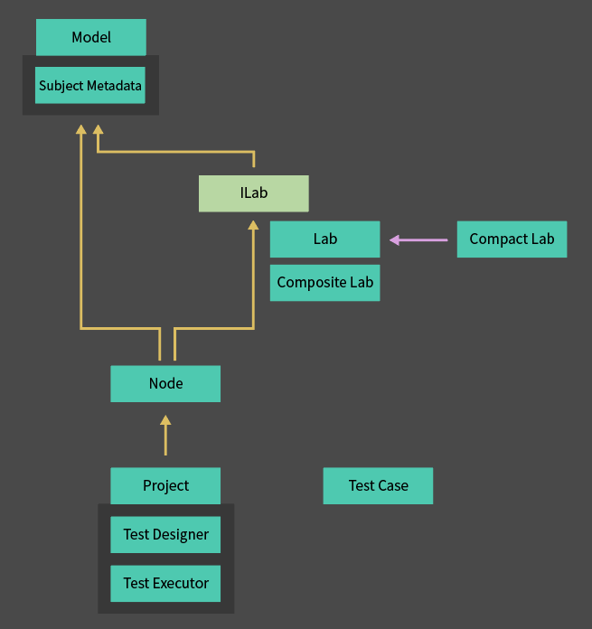

# Table of Contents

1. Uni Test Structure

2. Lab Behavior
	2.1 Lab Behavior
	2.2 Compact Lab Behavior
	2.3 Composite Lab Behavior
	2.4 Extending Labs Through Merge

3. Node Behavior
	3.1 Node Behavior
	3.2 Xml Report Generation

4. Project Behavior
	4.1 Project Behavior Pipeline
	4.2 Understanding Test Case

5. Test Design
	5.1 Test Design for Systems with a Single State
	5.2 Test Design for Systems with Multiple Independent States

## 1. Uni Test Structure

Uni Test has the following structure.



Components

**Model: unit object interface for the test target**
- `Subject`: the target object on which the actual test is performed
- `Metadata Group`: metadata storage specified by each Lab
- `Model Metadata`: test progress information for the Model (whether it can
  continue, remaining test count, and so on)

**Subject Metadata: metadata specified by each Lab**
- `Metadata`: metadata specified by the corresponding Lab (object)
- `Expected Exception Type`: the exception type the corresponding Lab expects
  to be returned when Act is performed
- `Model Metadata`: execution state information for the model expected by the corresponding Lab

**ILab: common Lab interface**
- `ID`: Lab identifier
- `Execute(IModel model)`: performs the test on model

**Lab: single AAA test unit**
- `SetMetadata(IModel) => object`: returns Metadata to store in the Model immediately before Arrange
- `Arranger(IModel, SubjectMetadata)`: sets the initial test state
- `Act(IModel, SubjectMetadata)`: performs the test operation
- `Assert(IModel, SubjectMetadata)`: verifies the test result

**Composite Lab: integrated test for multiple states**
- `CompositeLab(Lab original, Lab extension)`: extends an extension Lab based on the original Lab
- `Extend(Lab extension)`: adds a new Lab to the current composition structure

**Compact Lab: Lab builder** (a compact Lab builder that composes each AAA function with only IModel when SubjectMetadata is not used in single-state tests)

**Node: test execution unit** (a Model and Lab pair corresponding to one test)
- `ID`: Node identifier (same as the Lab ID)
- `Model`, `Lab`: Model and Lab objects corresponding to the test
- `Before`, `Afters`: connected Nodes corresponding to previous/subsequent tests
- `Execute()`: executes the stored Lab against its Model

**Project: overall test execution controller**
- `Execute(int depth)`: executes every possible test up to the specified depth
- `Terminate()`: stops test execution
- `CreateLabs(IModel) => IEnumerable<ILab>` : creates possible Labs for the input model (template method)

**Test Designer: next test generator**
- `Execute()`: creates next-stage Nodes possible from the current Model

**Test Executor: test executor**
- `Execute()`: runs the current Node.Execute and proceeds with the test

**TestCase: test execution information**
- `TestCases`: step-by-step execution information for the test

## 2. Lab Behavior

### 2-1 Lab Behavior

Lab is an execution unit object that performs an actual test on a Model.

Lab is an immutable object that is strictly separated from Model and does not hold any test target data internally. This structure secures Lab reusability and parallel-processing safety, allowing the same Lab to be reused repeatedly in various test environments.

Lab has methods that perform work as follows.

#### 2-1.1. Creation and Initialization

Lab is prepared with the following arguments.

1.  `ID`: Lab identifier

2.  AAA process execution arguments
    - `SetMetadata(IModel) => object` : creates metadata to store in the Model immediately before the test
    - `Arranger(IModel, SubjectMetadata)`: sets the Model to the initial state
    - `Act(IModel, SubjectMetadata)`: performs the test operation
    - `Assert(IModel, SubjectMetadata)`: verifies the test result

3.  Subject Metadata
    - `ExpectedExceptionType`: the exception type expected when Act is performed
    - `ToUncontinuable`: when true, the test ends as the final test
    - `RemainingExecutionCount`: remaining test execution count

#### 2-1.2. Do Arrange

The Arrange step configures the initial state of the Model.

1.  Copy the Lab's Subject Metadata and create new Subject Metadata (from this point, the metadata is considered owned by the Model)
2.  Call SetMetadata to create test state information and store it in the copied metadata
3.  Store the completed SubjectMetadata in Model.MetadataGroup
4.  Execute the Arranger delegate to perform the actual Arrange process on the input Model

#### 2-1.3. Do Act

The Actor delegate is executed to perform the actual Act process. Based on the expected returned exception type, it returns a failure exception both when an exception should occur but does not, and when an exception should not occur but does.

#### 2-1.4. Do Assert

The Asserter delegate is executed to perform the actual Assert process. At this time, the Asserter returns a failure exception when the test result differs from the expectation.

When a Lab runs independently, the Lab's Execute method calls DoArrange, DoAct, and DoAssert in order to proceed with the test. If the Lab is included as part of CompositeLab, CompositeLab calls those methods of the Lab sequentially.

Lab.Execute performs the full test in the following order.

0. Add an experiment record to Model and initialize Model.MetadataGroup
1. Run Do Arrange; if an error is returned, stop the test and prohibit subsequent tests for the Model
2. Run Do Act; if an error is returned, stop the test and prohibit subsequent tests for the Model
3. Run Do Assert; if an error is returned, stop the test and prohibit subsequent tests for the Model
4. Apply the test continuability/remaining test count stored in Model.Metadata to the Model, then end the test

### 2-2. Compact Lab Behavior

Compact Lab is a builder object that allows a Lab to be composed without Subject Metadata. It is designed so that tests can be defined and executed simply using only Model in environments that do not use metadata, such as single-state tests.

Compact Lab uses the following arguments and creates a normal Lab when the Build() method is called.

| Compact Lab               | Build | Lab                                       |
| ------------------------- | ----- | ----------------------------------------- |
| ID                        | ->    | ID                                        |
| None                      | ->    | SetMetadata (\_ => null)                  |
| Arranger (IModel)         | ->    | Arranger (IModel, SubjectMetadata = null) |
| Actor (IModel)            | ->    | Actor (IModel, SubjectMetadata = null)    |
| Asserter (IModel)         | ->    | Asserter (IModel, SubjectMetadata = null) |
| None (replaced by Assert.Throws) | -> | expectedExceptionType (null)             |
| ToUncontinuable           | ->    | ToUncontinuable                           |
| RemainingExecutionCount   | ->    | RemainingExecutionCount                   |

Characteristics

- Implements the AAA structure based only on IModel
- Internally, SubjectMetadata is always passed as null and processed
- Exception handling is implemented by defining Assert.Throws in Assert instead of ExpectedExceptionType

### 2-3. Composite Lab Behavior

Composite Lab is an object that connects several Labs sequentially to compose one test flow. Each Lab tests an independent state unit, and Composite Lab calls them in the appropriate order to test the whole system.

Composite Lab has the following two methods.

- `Extend(Lab extension)`: adds the input Lab to the lowest level of the existing test chain and extends the test
- `Execute`: executes the registered Labs in the correct order and performs the full test

Composite Lab's Execute operates in the following order.

#### 2-3.0. Preprocessing

- Add a test execution record to Model and initialize MetadataGroup.

#### 2-3.1. Do Arrange (upper -> lower order)

- Run each Lab's DoArrange from the upper Lab to the lower Lab. The original state must be initialized first, and then the extension state must be set for correct initialization.
- If an exception occurs, stop the test and prohibit subsequent tests for that Model.

#### 2-3.2. Do Act (only the top-level Lab runs)

- Perform only the top-level Lab's DoAct. This is because in one test flow, the principle is to perform only one Act, and duplicate execution can cause unintended side effects.
- If an exception occurs, stop the test and prohibit subsequent tests for that Model.

#### 2-3.3. Validity Decision

- Check SubjectMetadata.ToUncontinuable for every Lab, and immediately stop the test if any value is true. If even one non-continuable state occurs, the Model itself may have transitioned to an unreliable state.

#### 2-3.4. Do Assert (lower -> upper order)

- Run each Lab's DoAssert in reverse order, from the lower Lab to the upper Lab. The extension state must be verified first, and then the original state stacked above it must be verified so that responsibility can be traced accurately when a problem occurs.

- If an exception occurs, stop the test and prohibit subsequent tests for that Model.

#### 2-3.5. Apply Test State

- Update whether the Model can continue testing, the remaining test count, and so on according to the ModelMetadata held by the top-level Lab, then end the test.

### 2.4 Extending Labs Through Merge

Labs can be extended/derived in various ways depending on the test type. For example, when testing an Act that increases a value, several detailed cases can exist as follows.

- Increase the value by 1
- Increase the value by 10
- Increase the value by the default argument
- Increase the value by 0
- Increase the value by a negative number, and so on

Implementing every one of these situations as an individual Lab is inefficient. Instead, define the basic AAA logic for the basic situation first, then extend the Lab by modifying each element according to the situation. This allows tests for many situations to be generated efficiently.

An example of extending a Lab through Merge is as follows.

1. Define the base Lab

```csharp
var template = new Lab<Model>("Increase")
{
	Arranger = (model, metadata) =>
		model.value = (int)metadata.Metadata.value,

	Actor = (model, metadata) =>
		model.Increase((int)metadata.Metadata.value),
	   
	Asserter = (model, metadata) =>
		Assert.AreEqual(model.value, model.Subject.value)
 };
```

2. Define individual Labs based on the base Lab

```csharp
yield return new Lab<Model>("1")
{
	SetMetadata = _ => 1,
}.Merge(template);

yield return new Lab<Model>("10")
{
	SetMetadata = _ => 10,
}.Merge(template);

yield return new Lab<Model>("default")
{
	Arranger = (model, _) => model.value = model.defaultValue,
	Actor = (model, _) => model.Increase()
}.Merge(template, useArranger: false, useActor: false);

yield return new Lab<Model>("0")
{
	SetMetadata = _ => 0,
}.Merge(template);

yield return new Lab<Model>("negative")
{
	SetMetadata = _ => -1,
	Arranger = (_, metadata) =>
	{
		metadata.ToUncontinuable = true;
		metadata.ExpectedExceptionType = typeof(ArgumentOutOfRangeException);
	},
}.Merge(template, useArranger: false, useAsserter: false);
```


This has the effect of creating each of the following Labs.

```csharp
yield return new Lab<Model>("1")
{
	SetMetadata = _ => 1,

	Arranger = (model, metadata) =>
		model.value = (int)metadata.Metadata.value,
	Actor = (model, metadata) =>
		model.Increase((int)metadata.Metadata.value),
	Asserter = (model, metadata) =>
		Assert.AreEqual(model.value, model.Subject.value);
};

yield return new Lab<Model>("10")
{
	SetMetadata = _ => 10,

	Arranger = (model, metadata) =>
	     model.value = (int)metadata.Metadata.value,
	Actor = (model, metadata) =>
	     model.Increase((int)metadata.Metadata.value),
	Asserter = (model, metadata) =>
	     Assert.AreEqual(model.value, model.Subject.value);
};

yield return new Lab<Model>("default")
{
	Arranger = (model, _) =>
		model.value = model.defaultValue,
	Actor = (model, _) =>
		model.Increase(),
	Asserter = (model, metadata) =>
		Assert.AreEqual(model.value, model.Subject.value)
};

yield return new Lab<Model>("0")
{
	SetMetadata = _ => 0,

	Arranger = (model, metadata) =>
		model.value = (int)metadata.Metadata.value,
	Actor = (model, metadata) =>
		model.Increase((int)metadata.Metadata.value),
	Asserter = (model, metadata) =>
		Assert.AreEqual(model.value, model.Subject.value);
};

yield return new Lab<Model>("negative")
{
	SetMetadata = _ => -1,
	Arranger = (_, metadata) =>
	{
		metadata.ToUncontinuable = true;
		metadata.ExpectedExceptionType = typeof(ArgumentOutOfRangeException);
	},
	Actor = (model, metadata) => model.Increase((int)metadata.Metadata.value)
};
```

Combining Labs using Composite Lab and combining Labs using Merge have the following differences.

| Category | Composite Lab | Merge |
|---|---|---|
| Purpose | Compose one integrated test by combining several state-unit tests for one Act | Generate multiple derived tests from a base test within one state unit |
| Execution order | Sequential execution of lower -> upper Labs; DoArrange (upper -> lower); DoAct (top level once); DoAssert (lower -> upper) | Template Lab execution -> derived Lab execution; template Arrange -> derived Arrange; template Act -> derived Act; template Assert -> derived Assert |
| Optional execution of upper Lab | Not possible: every Lab runs in a fixed order | Possible: unnecessary steps can be skipped when generating derived Labs |
| State-unit report | Supported: the report shows which step the failed Lab belongs to | Not supported: the report does not show whether the failure occurred in the template or derived step |

## 3. Node Behavior

### 3-1. Node Behavior

Node is an object that represents one test execution step and is composed of a pair of Model and Lab.
Node represents a single step in the test flow and can compose the test transition flow through the Before and Afters fields, which indicate the order of tests.

Node has methods that perform work as follows.

#### 3-1.1. Creation and Initialization

Node can be created in the following two ways.

1.  Node(Lab lab)
	- Used when creating the first execution step of a test.
	- Creates a new Model and sets the received lab as the target Lab to execute.

2. Node(Node before, Lab lab)
	- Used when creating the second or later step of a test.
	- Creates a new Model and sets the received lab as the target Lab to execute.
	- Stores the before Node in the current Node's Before field and adds itself to the before.Lab.Afters list to form a connection between Nodes.
	- Then recursively explores its previous Nodes, stores the Labs of those Nodes in order, and executes those Labs sequentially on the current Node's Model so that the Model state matches the initial state required by the input Lab.

#### 3-1.2. Test Execution

Node performs a test by executing the stored Lab on the corresponding Model through the Execute method. If a test failure or exception occurs during test execution, Node stores the exception in its Exception field and sets Model.Continuable to false so that later tests are blocked. Also, even if no exception occurred during the test process, an external forced-stop exception caused by user interruption, test environment error, or another external factor can be manually injected by calling the SetExternalException method from outside.

### 3-2. Xml Report Generation

Node stores information about the test execution flow, such as its own state, test result, and connections to subsequent Nodes, in Xml form. This report allows users to trace the test expansion process and confirm which test failed in which context.

Node has the following Xml information.

- Inner Text: test progress information
- Root Node: the starting point of the test and does not have Model or Lab
- Waiting For Execution: the state where the test has not been executed yet
- Success/Failed: whether the executed test succeeded or failed
- Report: failure exception information
- Model: information about the test target model object held by the current Node
- History: the list of Lab IDs performed on the Model so far
- Continuable: whether subsequent tests can be performed
- Error: exception information when an error occurs during XML report generation
- Child Node: Xml files for subsequent Nodes

Users can selectively retrieve experiment information using the following extension methods.

- Count(Node) => int : the number of Nodes created after the corresponding Node
- All Succeed(Node) => bool : whether every test after the corresponding Node succeeded
- Get Failed Nodes(Node) => XmlNode : returns Xml information for every failed test Node after the corresponding Node

## 4.Project Behavior

### 4-1. Project Behavior Pipeline

Project is the core object that executes tests by calling each Node's Execute method, then creates subsequent Nodes according to the state of Node.Model and composes a continuous test flow.

Project consists of the following structure.


Components

- `Root Node`: the Node that becomes the starting point of the test and corresponds to the first Idle Node
- `Idle Nodes`: the set of Nodes waiting for the first step of the test cycle (Design)
- `Prepared Nodes`: the set of Nodes waiting for the second step of the test cycle (Execute)

Methods

- `Execute`: executes the full test process
- `Create Labs` (template method): creates executable Labs for the given Node.Model during the Design process

The process by which Project operates is as follows.

#### 4-1.0. Create Root Node

Root Node is the Node that becomes the starting point of every test Node and does not have Model or Lab. Root Node is stored in Idle Nodes before the Project.Execute process runs.

#### 4-1.1. Create Subsequent Nodes

The first process of Project.Execute creates subsequent Nodes for every Node currently in Idle Nodes. At this time, an object called Test Designer is responsible for creating subsequent Nodes for one Node.

Test Designer uses the Project.CreateLabs method to create subsequent tests for the input Node and creates subsequent Nodes based on them. The created subsequent Nodes have a copy (reproduction) of the Model from the original Node and a Lab. The created subsequent Nodes are then stored in Project.Prepared Nodes.

Model copying is performed by creating a new Model and then restoring state by replaying previous Labs sequentially, so it can consume many resources depending on the test. Therefore, Test Designer's work is performed asynchronously.

#### 4-1.2. Node Test Execution

The second process of Project.Execute calls the Execute method for every Node currently in Prepared Nodes to perform the actual test. At this time, an object called Test Executor is responsible for executing one Node's test, and it runs Node.Execute in an asynchronous environment so that the overall test flow is not interrupted.

When a test is completed, the Node is stored in Project.Idle Nodes if it is in a state where subsequent tests are possible. If it is not, it is not stored in Project. Even if a Node is not stored in Project, the user can access completed Nodes through the Node chain that continues in a tree shape from Root Node.

#### 4-1.3. Test Termination

Project.Execute can be stopped by the following conditions.

1.  Every Node satisfies the test depth set in advance
2.  Test time limit exceeded
3.  Exception occurred during testing
4.  User directly stops the test, and so on

When the test stops, Project returns Root Node, allowing the user to check the progress of the full test.

### 4.2 Understanding Test Case

#### 4-2.1. Test Case Extension

As seen earlier in '2.4 Extending Lab with Actor DTO', tests can be extended and derived in various ways depending on their type. For example, when testing an Act that increases a value, the following detailed cases can exist.

- Increase the value by 1
- Increase the value by 10
- Increase the value by the default argument
- Increase the value by 0 or a negative number, and so on

For an object with multiple independent states, if the part responsible for a lower state writes tests while considering every detailed test situation from the upper stage, the structure can become very complex. UniTest uses the following strategy to solve this.

- Lower states define only general commands.
- At the stage that composes the actual tests, tests corresponding to each detailed case are extended and composed.

Test Case is an object that stores these test commands sequentially by concretization stage. For example, the command 'increase the value by 1' is stored in the following two stages.

- Stage 1: 'increase value' (command type)
- Stage 2: 'increase by 1' (specific execution condition)

If an upper object wrote only the first stage, 'increase value', the composition part extends and composes tests for every case corresponding to that stage. If both the first and second items are written in Test Case, the composition stage writes only one corresponding test.

#### 4-2.2. Exclusive Definition of Test Case

When tests are composed using State Table, tests that can be applied to a Model are written based on every independent state combination the Model can have, so lower states may receive test commands unrelated to themselves. For example, in a kickboard object whose upper state is 'mounted state' and lower state is 'charging state', the action 'kickboard dismount' may have no meaning for the 'charging state' or may not be a concern.

When the input Test Case is unrelated to a lower state in this way, that lower state can pass the test corresponding to its stage by not setting its own Arranger / Asserter.

Test Case implements the following methods to determine whether the input definition applies to itself and, when necessary, provide a more precisely concretized Test Case.

- `Confineable(int index, out confined, object\[\] definitions) => bool`
	Returns true when the item at the given stage (index) is included in definitions, and returns the concretized TestCase satisfying that condition through confined

- `ConfineableExcept(int index, out confined, object\[\] definitions) => bool`
	Returns true when the item at the given stage (index) is not included in definitions, and at the same time returns a concretized TestCase excluding that condition through confined

Test Case also implements the following methods that can concretize itself.

- `Append(object definition, bool include)`: concretizes the next stage so that it includes/excludes definition
- `Confine(int index, object definition)`: fixes the item at a specific stage to the corresponding definition
- `Include(int index, object[] definitions)`: concretizes the item at a specific stage so that it includes all input list items
- `Exclude(int index, object[] definitions)`: concretizes the item at a specific stage so that it does not include all input list items

## 5. Test Design

### 5-1. Test Design for Systems with a Single State

Tests for a single-state-based system are designed through the following steps.

#### 5-1.1. Define the State - Operation Table

First, write the object's single state - operation table to organize every state and operation the object can have. Designing tests based on this table allows tests corresponding to every use case of the object to be designed systematically.

For example, the state - operation table of an electric kickboard is as follows.

State

- Idle: user waiting state
- Mounted: state where the user is using it
- Disposed: deleted state

Operation

- Mount: start of user use
	- Licensed: start use by a licensed user
	- Same: attempt by a user already using it to use it again
	- Not Licensed: attempt by an unlicensed user to use it
	- Null: attempt by a null user to use it
- Ride: actual kickboard riding by the user
- Dismount: end of user use
- Dispose: delete the kickboard


| Kickboard | -   | Mount              | <    | <                  | <            | Ride               | Dismount | Dispose                    |
| --------- | --- | ------------------ | ---- | ------------------ | ------------ | ------------------ | -------- | -------------------------- |
|           | -   | Licensed           | Same | Not Licensed       | Null         |                    |          |                            |
|           | -   |                    |      |                    |              |                    |          |                            |
| Idle      | -   | **Mounted**        | X    | _InvalidOperation_ | `<Dismount>` | _InvalidOperation_ | -        | **Disposed**               |
| Mounted   | -   | _InvalidOperation_ | -    | _InvalidOperation_ | ^            | `[Ride]`           | **Idle** | `<Dismount>` -> `<Dispose>` |
| Disposed  | -   | _ObjectDisposed_   | X    | _ObjectDisposed_   | ^            | _ObjectDisposed_   | -        | -                          |

#### 5-1.2. Define the Model

The model class used in tests is defined by inheriting UniTest.Model. This model contains the actual test target Subject, a Mock object that holds the expected state, and external resources (Assets) required for the experiment.

Below is an example of a Model class for testing an electric kickboard object.

```csharp
public class Model : UniTest.Model
{
    // Subject
    public SingleStatedKickboard Kickboard
    {
        get => (SingleStatedKickboard)Subject;
        set => Subject = value;
    }

    // Mock
    public Rider rider;
    public bool isDisposed;

    // Assets
    public Rider TargetedRider;
    public int RideCount = 0;
    public void OnRide() => RideCount++;

    // Content
    public override string ToString()
    {
        var sb = new StringBuilder();

        sb.Append($"Rider : {Kickboard.Rider?.Name ?? "None"}, ");
        sb.Append($"Disposed : {Kickboard.IsDisposed} | ");
        sb.AppendLine(base.ToString());

        return sb.ToString();
    }
}
```

Components

- `Subject`: the actual test target object. Because `base.Subject` is object type, cast it to a domain type suitable for the test before use.
- `Mock`: by defining the expected state externally, it allows the object's internal state to be verified indirectly. This secures test accuracy without accessing private members.
- `Assets`: objects to use in the experiment.
	- `Target Rider`: used to test the situation where the same `Rider` boards again.
	- `OnRide`: used to check whether the `Kickboard.OnRide` delegate was called normally.
- `Content`: other methods required for the experiment. In the case of `ToString`, it provides an easy-to-read string used when recording `Model` in the `Node` Xml file.

#### 5-1.3. Define the Project

Write an object that performs the actual tests by inheriting UniTest.Project.

Before writing the actual tests, this example writes the following two items to allow the test to proceed smoothly.

- `KickboardState`/`GetState`: an enum and method that determine which state the kickboard belongs to in the current state-operation table. It receives a Model and returns the kickboard's state.
- `Check`: a method that compares the kickboard's actual state with the Mock state and checks whether they match. It is mainly called in the Assert step and verifies whether the expected state and actual state match.

```csharp
enum KickboardState
{

    Idle,
    Mounted,
    Disposed,
}

KickboardState GetState(Model model)
{
    if (model.Kickboard.IsDisposed)
        return KickboardState.Disposed;
    if (model.Kickboard.Rider != null)
        return KickboardState.Mounted;
    else
        return KickboardState.Idle;
}

private void Check(Model model)
{
    Assert.IsNotNull(model, "Kickboard is Null");
    Assert.AreEqual(model.isDisposed, model.Kickboard.IsDisposed, "Dispose state mismatched");
    Assert.AreSame(model.rider, model.Kickboard.Rider, "Rider mismatched");
}
```

After preparation is complete, implement the CreateLabs template method to define which test cases will be generated for a given Model. In this implementation example, the test flow is designed by branching according to whether Model.Subject is null.

When Model.Subject is null, that is, when the kickboard has not yet been created, the test creates the kickboard, sets the Mock data needed for the experiment, and then checks its validity.

```csharp
protected override IEnumerable<ILab<Model>> CreateLabs(Model model)
{
    var labs = new List<CompactLab<Model>>();

    // Ignite
    if (model.Kickboard == null)
    {
        labs.Add(new("Ignite")
        {
            Actor = m =>
            {
                m.Kickboard = new();
                m.rider = null;
                m.isDisposed = false;
                m.TargetedRider = new(true, "Targeted Rider");
            },
            Asserter = Check
        });

        return labs.Select(l => l.Build());
    }

    // Handling when Model is not null
    // ...
}
```

When the kickboard has not been created, the Actor step initializes the kickboard and sets the related state. Then Check verifies whether the generated object's state matches the expected state.

When Model.Subject already exists, tests are written as follows.

1. Design test groups for every action the kickboard can perform.
2. For each experiment group, design tests the kickboard can execute in its current state.
3. Return every designed test.

```csharp
protected override IEnumerable<ILab<Model>> CreateLabs(Model model)
{
    var labs = new List<CompactLab<Model>>();

    // Handling when Model is null
    // ...

    // Mount
    switch (GetState(model))
    {
        case KickboardState.Idle:
            labs.Add(new("Mount_Licensed")
            {
                Arranger = m => m.rider = new Rider(true),
                Actor = m => m.Kickboard.Mount(m.rider),
                Asserter = Check
            });
            labs.Add(new("Mount_Targeted")
            {
                Arranger = m => m.rider = m.TargetedRider,
                Actor = m => m.Kickboard.Mount(m.rider),
                Asserter = Check
            });
            labs.Add(new("Mount_NotLicensed")
            {
                Actor = m => Assert.Throws<InvalidOperationException>(() => m.Kickboard.Mount(new Rider(false))),
                ToUncontinuable = true
            });
            labs.Add(new("Mount_Null")
            {
                Arranger = m => m.rider = null,
                Actor = modml => modml.Kickboard.Mount(null),
                Asserter = Check
            });
            break;

        case KickboardState.Mounted:
          // ...

        case KickboardState.Disposed:
          // ...

    }

    // Ride
    // ...

    // Dismount
    // ...

    // Dispose
    // ...

    return labs.Select(l => l.Build());
}
```

- Tests for the Mount operation test cases where the user is licensed, is the Targeted Rider, is not licensed, and is null, and verify exception occurrence and state matching.
- If needed, the ToUncontinuable = true flag in Compact Lab specifies that subsequent test generation should stop after the test fails.
- When the design of every test is complete, convert the tests to Lab form and return them.

#### 5-1.4. Project Execution

Calling the Project.Execute method allows the written tests to be performed asynchronously. At this time, the progress depth of the test can be specified as an argument to set how many stages of subsequent tests each Node should proceed through.

The Project.Run extension method can also be used to add the following functions.

- Test time limit: if the input time is exceeded, the test ends.
	This can prevent infinite repetition or excessive time consumption.

- Return only failed tests on failure: if a failure occurs during test execution, only the failed tests are filtered from the full execution result and returned.
	This allows the cause of failure to be analyzed more quickly.

- Xml output: test results are stored in XML format at the specified path.
	When loaded into an external visualization tool, the test flow and results can be checked visually.

### 5-2. Test Design for Systems with Multiple Independent States

Tests for a multiple-independent-state-based system are designed through the following steps.

#### 5-2.1. Define State - Operation Tables

First, write the object's state - operation table for each state and the Operations table to organize every state and operation the object can have. For example, the following is a state-operation table for an electric kickboard system with three independent states: Kickboard, Battery, and Charge.

State

- Kickboard: the top-level state of the kickboard
	- Idle: user waiting state
	- Mounted: state where the user is using it
	- Disposed: deleted state

- Battery: power state of the kickboard
	- Avaliable: usable state (battery is 10% or above)
	- Discharged: unusable state (battery is below 10%)
	- Disposed: state where the kickboard has been deleted

- Charge: charging state of the kickboard
	- Not Charging: state where it is not charging
	- Charging: state where it is charging
	- Disposed: state where the kickboard has been deleted

Operation

- Mount: start of user use
- Ride: actual kickboard riding by the user
- Dismount: end of user use
- Charge: start charging the kickboard
- Do Charge: charge the kickboard with the charger
- Stop Charging: end kickboard charging
- Dispose: delete the kickboard

#### Kickboard

| Kickboard | -   | Mount              | <    | <                  | <            | Ride               | Dismount | Dispose                    |
| --------- | --- | ------------------ | ---- | ------------------ | ------------ | ------------------ | -------- | -------------------------- |
|           | -   | Licensed           | Same | Not Licensed       | Null         |                    |          |                            |
|           | -   |                    |      |                    |              |                    |          |                            |
| Idle      | -   | **Mounted**        | X    | _InvalidOperation_ | `<Dismount>` | _InvalidOperation_ | -        | **Disposed**               |
| Mounted   | -   | _InvalidOperation_ | -    | _InvalidOperation_ | ^            | `[Ride]`           | **Idle** | `<Dismount>` -> `<Dispose>` |
| Disposed  | -   | _ObjectDisposed_   | X    | _ObjectDisposed_   | ^            | _ObjectDisposed_   | -        | -                          |

#### Battery

| Battery    | -   | Check         | <              | Mount (override) | Ride (override)            |
| ---------- | --- | ------------- | -------------- | ---------------- | -------------------------- |
|            | -   | Battery > 10% | Battery <= 10% |                  |                            |
|            | -   |               |                |                  |                            |
| Available  | -   | -             | **Discharged** | `[base]`         | `[base]` -> `[Use Battery]` |
| Discharged | -   | **Available** | -              | -                | -                          |

#### Charge State

| Charge State | -   | Charge                      | Do Charge     | Stop Charging    | Mount (override)                          | Ride (override)    | Dispose (override)           |
| ------------ | --- | --------------------------- | ------------- | ---------------- | ----------------------------------------- | ------------------ | ---------------------------- |
|              | -   |                             |               |                  |                                           |                    |                              |
| Not Charging | -   | `<Dismount>` -> **Charging** | X             | -                | `[base]`                                  | `[base]`           | `[base]`                     |
| Charging     | -   | -                           | `[Do Charge]` | **Not Charging** | `<Stop Charging>` -> `[base if available]` | _InvalidOperation_ | `<Stop Charging>` -> `[base]` |
| Disposed     | -   | _ObjectDisposed_            | X             | -                | `[base]`                                  | _ObjectDisposed_   | -                            |

### Operations

| Operations | -   | Mount | Ride | Dismount | Charge | Do Charge | Stop Charging | Dispose |
| ---------- | --- | ----- | ---- | -------- | ------ | --------- | ------------- | ------- |
|            | -   |       |      |          |        |           |               |         |
| Kickboard  | -   | Mount | Ride | Dismount | X      | X         | X             | Dispose |
| Battery    | -   | Mount | Ride | -        | X      | X         | X             | Dispose |
| Charge State | -   | Mount | Ride | -        | Charge | Do Charge | Stop Charging | Dispose |


#### 5-2.2. Define the Model

The model used in the test is defined by inheriting UniTest.Model, as in the model defined earlier for the tests of a single-state-based system. The model contains the actual test target Subject, a Mock object that holds the expected state, and external resources (Assets) required for the experiment.

Below is an example of a Model class for testing an electric kickboard object.

```csharp
public class Model : UniTest.Model
{
    // Subject
    public MultiStatedKickboard Kickboard
    {
        get => (MultiStatedKickboard)Subject;
        set => Subject = value;
    }

    // Mock
    public Rider rider;
    public int battery;
    public bool charging;
    public bool isDisposed;

    // Assets
    public Rider TargetedRider;
    public int RideCount = 0;

    public void OnRide() => RideCount++;

    public class Charger : IObservable<object>
    {
        List<IObserver<object>> observers = new();
        public IDisposable Subscribe(IObserver<object> observer)
        {
            observers.Add(observer);
            return new Token(() => observers.Remove(observer));
        }

        public void DoCharge() => observers.ForEach(o => o.OnNext(null));

        class Token : IDisposable
        {
            Action onDispose;

            public Token(Action onDispose) => this.onDispose = onDispose;
            public void Dispose()
            {
                onDispose?.Invoke();
                onDispose = null;
            }
        }
    }

    public Charger TargetCharger;

    // Content

    public override string ToString() { ... }
}
```

Components

- `Subject`: the actual test target object
- `Mock`: expected state data for the kickboard
- `Assets`: objects to use in the experiment
	- `Target Rider`: used to test the situation where the same `Rider` boards again
	- `OnRide`: used to check whether the `Kickboard.OnRide` delegate was called normally
	- `Target Charger`: kickboard charging object
- `Content`: other methods required for the experiment

#### 5-2.3. Define the Project

Write an object that performs the actual tests by inheriting UniTest.Project. At this time, tests must be written starting from the upper states the system has, and tests corresponding to upper states must be written so that they do not depend on tests corresponding to lower states.

Before writing the actual tests, this example writes the following three items to allow the test to proceed smoothly.

- MainTestCase
	An object that exists at the top of Project and stores the top-level classification of actions the kickboard can perform.
	TestCase can be designed based on this value.

```csharp
public enum MainTestCase
{
    Create,
    Mount,
    Ride,
    Dismount,
    Charge,
    DoCharge,
    StopCharging,
    Dispose,
}
```

- Check
	A method that exists at the top of Project and compares the kickboard's actual state with the Mock state to check whether they match.
	It is mainly called in the Assert step and verifies whether the expected state and actual state match.

```csharp
void Check(Model model, SubjectMetadata _ = default)
{
    Assert.IsNotNull(model, "Kickboard is Null");

    Assert.AreEqual(model.isDisposed, model.Kickboard.IsDisposed, "Dispose state mismatched");
    Assert.AreSame(model.rider, model.Kickboard.Rider, "Rider mismatched");
    Assert.AreEqual(model.charging, model.Kickboard.Charging, "Charging State Mismatched");
    Assert.AreEqual(model.battery, model.Kickboard.Battery, "Battery Mismatched");

    if (model.isDisposed) return;

    Assert.AreEqual(model.battery > 10, model.Kickboard.Available, "Available State Mismatched");
}
```

- GetActors(TestCase) => ActorDTOs
	A function that returns the list of Actor DTOs corresponding to the given TestCase.
	Using this, the actual test case can be implemented for every degree of concretization of TestCase in every part of the project.

```csharp
IEnumerable<ActorDTO<Model>> GetActors(TestCase testCase)
{
    if (testCase.Confineable(0, MainTestCase.Create)) { ... }
    if (testCase.Confineable(0, MainTestCase.Mount))
    {
        if (testCase.Confineable(1, "Licensed"))
            yield return new()
            {
                ID = "Mount_Licensed",
                SetArrangeData = _ => new Rider(true),
                Actor = (m, md) => m.Kickboard.Mount((Rider)md.Metadata)
            };

        if (testCase.Confineable(1, "Same"))
            yield return new()
            {
                ID = "Mount_Same",
                SetArrangeData = m => m.rider,
                Actor = (m, _) => m.Kickboard.Mount(m.rider)
            };

        if (testCase.Confineable(1, "NotLicensed"))
            yield return new()
            {
                ID = "Mount_NotLicensed",
                SetArrangeData = _ => new Rider(false),
                Actor = (m, md) => m.Kickboard.Mount((Rider)md.Metadata)
            };

        if (testCase.Confineable(1, "Null"))
            yield return new()
            {
                ID = "Mount_Null",
                SetArrangeData = _ => null
                Actor = (m, _) => m.Kickboard.Mount(null)
            };

        if (testCase.Confineable(1, "Targeted"))
            yield return new()
            {
                ID = "Mount_Targeted",
                SetArrangeData = m => m.TargetedRider,
                Actor = (m, _) => m.Kickboard.Mount(m.TargetedRider)
            };
    }

    if (testCase.Confineable(0, MainTestCase.Ride)) { ... }
    if (testCase.Confineable(0, MainTestCase.Dismount)) { ... }
    if (testCase.Confineable(0, MainTestCase.Charge)) { ... }
    if (testCase.Confineable(0, MainTestCase.DoCharge)) { ... }
    if (testCase.Confineable(0, MainTestCase.StopCharging)) { ... }
    if (testCase.Confineable(0, MainTestCase.Dispose)) { ... }

}
```

##### 5-2.3.1. Define Kickboard Tests

After preparation is complete, first write tests for Kickboard, the top-level state.
Before writing the tests, define the enum used to determine the internal state that applies to that state and the function that returns it.

```csharp
enum State
{
    Ignite,
    Idle,
    Mounted,
    Disposed,
}

State GetState(Model model)
{
    if (model.Kickboard == null)
        return State.Ignite;
    if (model.isDisposed)
        return State.Disposed;
    if (model.rider == null)
        return State.Idle;
    else
        return State.Mounted;
}
```

First, handle the case where TestCase is Create. After that, use the GetActors function to extend the corresponding case in various execution ways.

```csharp
IEnumerable<Lab<Model>> CreateLabs_Kickboard(Model model, TestCase testCase)
{
    if (testCase.Count == 0)
        throw new TestCaseAbsentException(nameof(testCase));

    TestCase tc;

    var state = GetState(model);

    if (testCase.Confineable(0, out tc, MainTestCase.Create))
        return new Lab<Model>()
        {
            ID = "ignite",
            Arranger = (m, md) =>
            {
                m.TargetedRider = new Rider(true, "Targeted Rider");
                m.TargetCharger = new Model.Charger();
                m.isDisposed = false;
                m.battery = (int)md.Metadata;
            },
            Asserter = Check
        }.Extend(GetActors(tc));

    // Handling when testCase is not Create
    // ...
    }
}
```

When the case is not Create, define tests by splitting conditions according to each MainTestCase as follows. At this time, if branches are used instead of switch branches to flexibly handle combinations of multiple conditions.

```csharp
IEnumerable<Lab<Model>> CreateLabs_Kickboard(Model model, TestCase testCase)
{
    // Handling when testCase is Create
    // ...

    var labs = new List<Lab<Model>>();

    if (testCase.Confineable(0, out var _tc, MainTestCase.Mount))
    {
        if (_tc.Confineable(1, out tc, "Licensed"))
            Licensed();

        if (_tc.Confineable(1, out tc, "Same") && model.rider != null)
            Same();

        if (_tc.Confineable(1, out tc, "NotLicensed"))
            NotLicensed();

        if (_tc.Confineable(1, out tc, "Null"))
            Null();
    }

    if (testCase.Confineable(0, out tc, MainTestCase.Ride)) Ride();
    if (testCase.Confineable(0, out tc, MainTestCase.Dismount)) Dismount();
    if (testCase.Confineable(0, out tc, MainTestCase.Dispose)) Dispose();

    return labs;

    // Define internal functions
    // ...
```

Then compose tests based on the AAA pattern through internal functions corresponding to each branch condition, and also define exception occurrence and test continuability according to the state - operation table.

```csharp
IEnumerable<Lab<Model>> CreateLabs_Kickboard(Model model, TestCase testCase)
{
    // testCase branch
    // ...

    return labs;

    void Licensed()
    {
        if (state == State.Idle)
        {
            labs.AddRange(new Lab<Model>
            {
                ID = "idle",
                Arranger = (m, md) => m.rider = (Rider)md.Metadata,
                Asserter = Check
            }.Extend(GetActors(tc)));
        }
        else if (state == State.Mounted)
        {
            labs.AddRange(new Lab<Model>("mounted",
                expectedExceptionType: typeof(InvalidOperationException),
                toUncontinuable: true)
                .Extend(GetActors(tc)));
        }
        else if (state == State.Disposed)
        {
            labs.AddRange(new Lab<Model>("disposed",
                asserter: Check,
                expectedExceptionType: typeof(ObjectDisposedException),
                toUncontinuable: true)
                .Extend(GetActors(tc)));
        }
        else
            throw new InvalidTestException(state, model);
    }

    void Same() { ... }
    void NotLicensed() { ... }
    void Null() { ... }
    void Ride() { ... }
    void Dismount() { ... }
    void Dispose() { ... }
}
```

##### 5-2.3.2. Define Battery/Charge Tests

Unlike the Kickboard state, Battery and Charge states have only two states (except for the Disposed state), so tests are composed only through condition branches without defining a separate enum.

After composing the tests, the previously defined CreateLabs_Kickboard function is called as needed to extend the test to the upper state. Conversely, when the test should not be passed to the upper state and should end at the current step, GetActors is called to complete the test composition at the current step.

For operations unrelated to the Battery state, except Mount and Ride, ConfineableExcept is used so that the current step does not compose the test and the upper step can compose the test.

```csharp
IEnumerable<Lab<Model>> CreateLabs_Kickboard(Model model, TestCase testCase)
{
    // testCase branch
    // ...

    return labs;

    void Licensed()
    {
        if (state == State.Idle)
        {
            labs.AddRange(new Lab<Model>
            {
                ID = "idle",
                Arranger = (m, md) => m.rider = (Rider)md.Metadata,
                Asserter = Check
            }.Extend(GetActors(tc)));
        }
        else if (state == State.Mounted)
        {
            labs.AddRange(new Lab<Model>("mounted",
                expectedExceptionType: typeof(InvalidOperationException),
                toUncontinuable: true)
                .Extend(GetActors(tc)));
        }
        else if (state == State.Disposed)
        {
            labs.AddRange(new Lab<Model>("disposed",
                asserter: Check,
                expectedExceptionType: typeof(ObjectDisposedException),
                toUncontinuable: true)
                .Extend(GetActors(tc)));
        }
        else
            throw new InvalidTestException(state, model);
    }

    void Same() { ... }
    void NotLicensed() { ... }
    void Null() { ... }
    void Ride() { ... }
    void Dismount() { ... }
    void Dispose() { ... }
}
```

##### 5-2.3.3. Define the Project Entry Point

Finally, define the template method CreateLabs to compose the project entry point. This function is called first when test execution starts, and it calls the lowest state test function (CreateLabs_Charge) as the starting point so that internally the full test hierarchy is performed sequentially from the bottom up.

```csharp
protected override IEnumerable<ILab<Model>> CreateLabs(Model model)
{
    if (model.Subject == null)
    {
        foreach (var lab in CreateLabs_Charge(model, new(MainTestCase.Create)))
            yield return lab;

        yield break;
    }

    foreach (MainTestCase testCase in Enum.GetValues(typeof(MainTestCase)))
    {
        if (testCase == MainTestCase.Create)
            continue;

        foreach (var lab in CreateLabs_Charge(model, new(testCase)))
            yield return lab;
    }
}
```
